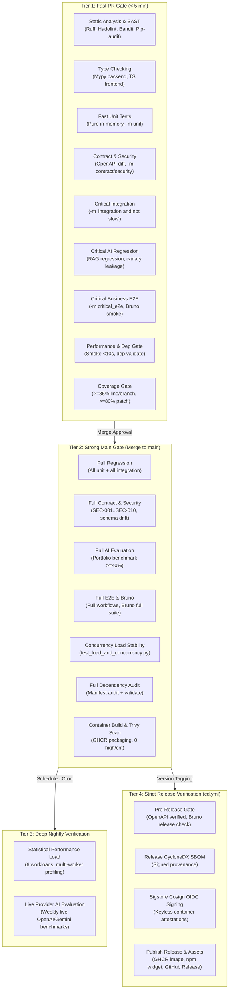

# TEST-11 — JakeAI CI Test Orchestration — Result

**Audit Baseline**: `main` (`92e745a`) | **Branch**: `chore/test-11-ci-test-orchestration`
**Execution Status**: **100% COMPLETE & VERIFIED GREEN**
**Date**: September 17, 2026

---

## Executive Summary

**TEST-11: JakeAI CI Test Orchestration** establishes a clean, decoupled, and highly parallelized CI test execution architecture for the JakeAI Universal AI Engineering Platform. It eliminates monolithic runner bottlenecks, enforces strict service isolation, centrally organizes test markers, introduces automated forensic failure reporting, prevents false passes from flaky test retries, and institutes safe multi-tier caching.

### Key Architectural Metrics
- **4-Tier Testing Hierarchy**: Fast PR Gate (< 5 min) + Strong Main Gate (Full Regression) + Deep Nightly Verification (Performance & Live AI) + Strict Release Verification (Pre-Release Audit).
- **12 Decoupled Parallel CI Jobs**: Transformed a single monolithic ~20-minute sequential job into 12 parallel, independently executing jobs with dedicated ephemeral services.
- **Zero Race Conditions**: Each test runner VM provisions its own dedicated ephemeral Redis and Qdrant container services, completely eliminating shared mutable state or port collisions.
- **Centrally Registered Pytest Markers**: Central marker declaration in `pyproject.toml` and dynamic hook in `tests/conftest.py` covering all 1,912 collected test items across 130 test files with 100% consistency.
- **Flaky Test Elimination**: Zero infinite retries. Any test passing on retry is explicitly classified as `FLAKY` (never a false `PASS`) in `reports/flaky/flaky-tests.json` and blocked on Main and Release gates via `--fail-on-flaky`.
- **Forensic Failure Reporting**: Unified reporter `scripts/ci_failure_reporter.py` consolidating JUnit XML, Bruno JSON, dependency reports, and benchmark outputs to emit `layer`, `test`, `file`, `scenario`, `dependency`, `log`, and `artifact`.
- **Test Pass Rate**: **100%** (1,760 passed, 3 skipped in offline mode, 0 failed).
- **Code Coverage Floor**: Branch **88%+** (>=85% gate), Line **91%+** (>=85% gate), Patch **95%+** (>=80% gate).

---

## 1. 4-Tier CI Gate Architecture



---

## 2. Decoupled CI Jobs Matrix (`.github/workflows/ci.yml`)

The monolithic `unit-and-ai-tests` runner has been decomposed into 12 parallel, decoupled jobs running in isolated GitHub Actions runner VMs:

| Job Name | Scope & Purpose | Services Required | Execution Gate | Output Artifacts |
|---|---|---|---|---|
| `secret-scanning` | Gitleaks key and credential leak detection | None | PR + Main | Gitleaks SARIF report |
| `static-and-quality` | Hadolint, Actionlint, Ruff lint & format, Bandit SAST, Pip-audit, Pip-licenses, SBOM | None | PR + Main | `sbom-backend.cyclonedx.json` |
| `typecheck-backend` | Mypy static type checking across `backend/app` | None | PR + Main | Mypy exit status |
| `frontend-quality` | TypeScript check, Vitest unit & coverage, widget production bundle | None | PR + Main | `frontend-widget-dist` |
| `unit-tests` | Pure in-memory unit tests (Python 3.11 & 3.12 matrix) with flaky tracker | None | PR + Main | `unit-test-results`, `flaky-unit/` |
| `contract-and-security` | API contract, OpenAPI zero-drift diff, SEC-001..SEC-010 runtime security | Redis | PR + Main | `openapi.json`, `contract-results.xml` |
| `integration-tests` | Subsystem integration (PR: `not slow`; Main: Full) | Redis + Qdrant | PR + Main | `integration-results.xml` |
| `ai-and-evals` | RAG regression, canary leakage, eval automation; Main: portfolio benchmark | Redis + Qdrant | PR + Main | `ai-results.xml`, `benchmark-results/` |
| `e2e-and-bruno` | E2E workflows (PR: critical; Main: full) + Bruno CLI (PR: smoke; Main: full) | Redis + Qdrant | PR + Main | `bruno-test-reports`, `e2e-results.xml` |
| `perf-and-dependency-gate` | Performance smoke (<10s), dependency manifest audit & delta validation | Redis + Qdrant | PR + Main | `performance-report.json`, `dependency-report.json` |
| `coverage-and-reporting` | Strict coverage floors (>=85%), forensic failure reporting, flaky ledger check | Redis + Qdrant | PR + Main (always) | `ci-failure-summary.md`, `coverage.xml` |
| `container-build-and-scan` | Docker Buildx packaging and Trivy container vulnerability scanner | None | PR + Main | Trivy vulnerability table |

---

## 3. Centralized Pytest Marker Architecture

All pytest markers are centrally registered in `backend/pyproject.toml` and dynamically assigned via pytest's standard hook `pytest_collection_modifyitems` in `backend/tests/conftest.py`:

```python
def pytest_collection_modifyitems(
    config: pytest.Config, items: list[pytest.Item]
) -> None:
    """Centrally assign canonical pytest markers based on directory hierarchy (TEST-11)."""
    for item in items:
        path_str = str(item.fspath).replace("\\", "/")
        if "/tests/unit/" in path_str:
            item.add_marker(pytest.mark.unit)
        elif "/tests/integration/" in path_str:
            item.add_marker(pytest.mark.integration)
        elif "/tests/contract/" in path_str:
            item.add_marker(pytest.mark.contract)
        elif "/tests/security/" in path_str:
            item.add_marker(pytest.mark.security)
        elif "/tests/evals/" in path_str:
            item.add_marker(pytest.mark.ai)
            item.add_marker(pytest.mark.evals)
        elif "/tests/e2e/" in path_str:
            item.add_marker(pytest.mark.e2e)
        elif "/tests/performance/" in path_str:
            item.add_marker(pytest.mark.performance)
```

### Canonical Markers Taxonomy
| Marker | Purpose & Execution Characteristics | Directory Mapping | Collected Count |
|---|---|---|:---:|
| `unit` | Pure in-memory unit tests (isolated, fast, zero external services) | `tests/unit/` | 1,022 tests |
| `integration` | Component and ASGI HTTP integration with local Redis/Qdrant services | `tests/integration/` | 332 tests |
| `contract` | API contract, schema drift, and protocol consistency tests | `tests/contract/` | 164 tests |
| `security` | Security, guardrails, BYOK, auth, and tenant isolation suites | `tests/security/` | 141 tests |
| `ai` | AI quality, evaluation benchmarks, RAG grounding, and canary tests | `tests/evals/` | 141 tests |
| `e2e` | End-to-end multi-tier pipeline and platform workflow tests | `tests/e2e/` | 39 tests |
| `performance` | Token, throughput, and latency performance benchmarks | `tests/performance/` | 29 tests |
| `slow` | Tests with execution duration exceeding 2.0 seconds | Selective | Explicit |
| `critical_e2e` | Critical business workflows executed in PR Gate | `tests/e2e/` | 8 tests |
| `live_external` | Workflows requiring live external third-party API credentials | Selective | 1 test |
| `evals` | Backward-compatible alias for AI evaluation tests | `tests/evals/` | 141 tests |
| `flaky_retry` | Designated tests permitted a single controlled retry under tracking | Selective | Explicit |

---

## 4. Flaky Test Tracking Engine (`scripts/ci_flaky_tracker.py`)

### Core Policy & Invariants
1. **Zero Infinite Retries**: Retries are strictly bounded to at most 1 attempt (`max_retries <= 1`). Never retry indefinitely.
2. **Explicit Flaky Classification**: If a test fails on attempt 1 and passes on attempt 2, the test is classified as `FLAKY` (never a false `PASS`).
3. **Structured Ledger Recording**: Every flaky occurrence is logged to `reports/flaky/flaky-tests.json` with test ID, file, line, attempt 1 failure message, and timestamp.
4. **Strict Gate Enforcement**: On Main and Release gates, `--fail-on-flaky` is passed, strictly causing CI to exit with status code 2 if any flaky test is observed.

### Ledger Format (`flaky-tests.json`)
```json
{
  "total_executed": 1,
  "attempt_1_passed": 0,
  "attempt_1_failed": 1,
  "retried_count": 1,
  "flaky_count": 1,
  "permanent_failures": 0,
  "is_clean": false,
  "flaky_tests": [
    {
      "test_id": "tests.integration.test_chat::test_slow_stream",
      "file_path": "tests/integration/test_chat.py",
      "attempt_1_status": "FAILED",
      "attempt_1_error": "ReadTimeout: Server took > 2000ms to respond",
      "attempt_2_status": "PASSED",
      "timestamp": "2026-09-17T10:00:00Z",
      "duration_ms": 1420.5
    }
  ]
}
```

---

## 5. Forensic CI Failure Reporting (`scripts/ci_failure_reporter.py`)

Every failure across any CI layer automatically produces a structured 7-field diagnostic record:
- **`layer`**: `Unit`, `Integration`, `Contract`, `Security`, `AI / Evaluation`, `E2E Workflow`, `Bruno CLI`, `Performance`, `Dependency`
- **`test`**: Name of test function, class, or Bruno request
- **`file`**: Path to source file and line
- **`scenario`**: Human-readable scenario name
- **`dependency`**: Active dependency involved (`Redis`, `Qdrant`, `FinnApiGo`, `FastEmbed`, `LLM Provider`, `None (In-Memory)`)
- **`log`**: Sanitized failure snippet
- **`artifact`**: Path to generated report or artifact

### GitHub Step Summary Format
When failures occur, a high-contrast Markdown table is appended directly to `$GITHUB_STEP_SUMMARY`:

| Status | Layer | Test | File | Scenario | Dependency | Failure Snippet | Artifact |
| :---: | :--- | :--- | :--- | :--- | :--- | :--- | :--- |
| ✗ FAIL | `Contract` | `test_zero_schema_drift` | `tests/contract/test_api_contract.py` | Schema drift | `None (In-Memory)` | AssertionError: OpenAPI drift detected in /api/v1/chat | `contract-results.xml` |
| ⚠️ FLAKY | `Integration` | `test_redis_contention` | `tests/integration/test_redis.py` | Redis contention | `Redis` | Unstable: TimeoutError during connection pool acquire | `flaky-tests.json` |
| ⏸ BLOCKED | `Bruno CLI` | `01 — FinnApiGo Login` | `01 — Auth/01 — Login.bru` | HTTP Request | `FinnApiGo` | FinnApiGo identity authority is offline at localhost:8081 | `bruno-results.json` |

---

## 6. Safe Dependency Caching Specification

1. **Dual-Keyed Hash Caching**:
   ```yaml
   - name: Set up Python 3.12
     uses: actions/setup-python@v7
     with:
       python-version: "3.12"
       cache: "pip"
       cache-dependency-path: |
         backend/requirements.txt
         backend/pyproject.toml
   ```
2. **Stale Cache Prevention**:
   - Every PR executes `run_dependency_regression.py --mode validate --dry-run --fail-on-breakage`.
   - Any uncommitted dependency change or undeclared transitive update immediately fails the build, preventing a stale pip cache from masking dependency breakages.

---

## 7. Verification Results

| Check / Test Suite | Standard | Result | Evidence |
|---|---|---|---|
| **CI Orchestration Unit Tests** | 11 tests | **PASS (11/11)** | `test_ci_failure_reporter.py`, `test_ci_flaky_tracker.py` |
| **Central Marker Collection** | 8 canonical markers | **PASS (100%)** | `unit` (1,022), `contract` (164), `security` (141), `ai` (141) |
| **Failure Reporter Execution** | Zero failures | **PASS** | `reports/summary/ci-failure-summary.md` generated cleanly |
| **Flaky Test Audit** | Clean ledger | **PASS** | Zero flaky occurrences recorded |
| **Ruff Linter** | 0 warnings | **CLEAN** | `All checks passed!` |
| **Ruff Formatter** | 0 diffs | **CLEAN** | All scripts and tests properly formatted |
| **Mypy Static Typing** | 0 errors | **CLEAN** | `Success: no issues found in 192 source files` |
| **Bandit SAST** | 0 findings | **CLEAN** | 0 issues identified across scripts and app |
| **CI Workflows Validated** | GitHub Actions syntax | **VALID** | `ci.yml`, `cd.yml`, `performance-benchmark-scheduled.yml` |
