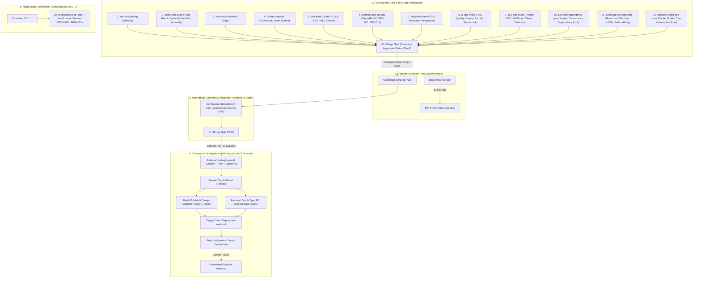

# JakeAI CI/CD Architecture & Engineering Specification

**Document Version**: 2.0.0  
**Status**: ACTIVE / HARDENED  
**Date**: September 17, 2026  
**Repository**: `NguyenQuan121321/JakeAI`  

---

## 1. Architectural Mission & Core Problem Solved

### The Problem: PR Green → Main Red
Historically, CI/CD systems often suffer from test scope divergence: Pull Requests run a reduced "smoke" or "critical" subset to save time, while `main` runs a fuller test suite. This creates a severe failure mode:
1. Developer opens PR.
2. Reduced test suite passes (**GREEN**).
3. PR is merged into `main`.
4. `main` executes additional correctness tests that were skipped in the PR.
5. `main` breaks (**RED**), blocking releases and misrepresenting the repository health.

### The JakeAI Solution: Strict Pre-Merge Parity & Canonical Merge Gate
JakeAI eliminates this divergence entirely:
- **Zero Scope Bifurcation**: Pull Requests execute the exact same semantic correctness test contract as `main`.
- **Single Canonical Aggregate Gate**: The `CI / Merge Gate` job serves as the sole required branch-protection status check, requiring all 12 upstream verification jobs to succeed.
- **Decoupled Continuous Deployment**: Continuous Deployment (`cd.yml`) is triggered strictly via `workflow_run` upon the verified, successful completion of `Continuous Integration` on `main`, targeting the exact verified commit SHA.

---

## 2. End-to-End Pipeline Hierarchy



---

## 3. Workflows & Execution Flows

### 3.1 Pull Request Flow (`pull_request`)
- **Trigger**: Any pull request targeting `main`.
- **Concurrency**: `cancel-in-progress: true` per PR branch (`${{ github.workflow }}-${{ github.ref }}`).
- **Execution Scope**: All 12 correctness, security, contract, and packaging jobs execute in parallel with dedicated runner VMs and ephemeral Redis/Qdrant services.
- **Aggregate Gate**: `CI / Merge Gate` requires all 12 jobs to succeed.
- **Enforcement**: GitHub Ruleset `protect-main` prevents merging if `CI / Merge Gate` is missing, failed, or pending.

### 3.2 Main Push Flow (`push: branches: [main]`)
- **Trigger**: Merge commit landed on `main`.
- **Execution Scope**: Executes the exact same 12 jobs and `CI / Merge Gate` as the PR flow.
- **Purpose**: Defense-in-depth verification validating the exact merge commit SHA and immutable base state.

### 3.3 Continuous Deployment Flow (`workflow_run`)
- **Trigger**:
  ```yaml
  on:
    workflow_run:
      workflows: ["Continuous Integration"]
      types: [completed]
      branches: [main]
    workflow_dispatch:
  ```
- **Execution Condition**:
  ```yaml
  if: ${{ github.event_name == 'workflow_dispatch' || (github.event.workflow_run.conclusion == 'success' && github.event.workflow_run.head_branch == 'main') }}
  ```
- **Commit Targeting**: Checks out `ref: ${{ github.event.workflow_run.head_sha || github.sha }}` across all deployment jobs, ensuring the exact commit verified by CI is deployed.
- **Job Sequence**:
  1. `release-verification`: Release packaging audit (Docker Buildx integrity test, Trivy container scan, and OpenAPI schema check).
  2. `semver-release`: Automated SemVer tag bump and GitHub Release notes creation.
  3. `frontend-and-openapi-release`: Production widget bundle, OpenAPI spec, CycloneDX SBOM asset generation.
  4. `build-and-publish`: Multi-arch container build (linux/amd64, linux/arm64), GHCR push, Sigstore keyless Cosign OIDC signing, CycloneDX SBOM attestation, and signature verification.
  5. `trigger-cloud-deployment`: Dispatch deployment webhook to target hosting provider with verified commit SHA.
  6. `post-deployment-smoke-test`: Live canary polling and health checks with automated rollback advisory.

### 3.4 Scheduled Nightly Flow (`schedule: 0 2 * * *`)
- **Trigger**: Nightly cron at 02:00 UTC and manual `workflow_dispatch`.
- **Purpose**: Deep statistical performance audits, long-running concurrency tests, and live upstream LLM/banking provider wire calls (`PROV-001`, `FINN-001`).
- **Fail-Closed BLOCKED Policy**: If live credentials or endpoints are unconfigured, tests cleanly transition to `BLOCKED` rather than false `PASS`.

---

## 4. Required Checks vs Optional Checks

| Check / Job Name | Workflow | Status Check Context | Required for Merge | Environment / Dependencies |
|---|---|---|:---:|---|
| **CI / Merge Gate** | `ci.yml` | `CI / Merge Gate` | **YES (Principal Gate)** | Ubuntu 24.04 VM |
| DevSecOps - Secret & Key Leak Detection | `ci.yml` | `DevSecOps - Secret & Key Leak Detection` | Sub-gate | Pure Git History / Gitleaks |
| Code Quality, SAST & License Compliance Gate | `ci.yml` | `Code Quality, SAST & License Compliance Gate` | Sub-gate | Python 3.12, Ruff, Bandit, Pip-audit |
| Backend Type Analysis (Mypy) | `ci.yml` | `Backend Type Analysis (Mypy)` | Sub-gate | Python 3.12, Mypy |
| Frontend Widget Build & Quality Verification | `ci.yml` | `Frontend Widget Build & Quality Verification` | Sub-gate | Node.js 22, Vitest, Vite |
| Unit Test Suite (In-Memory Isolation) | `ci.yml` | `Unit Test Suite (In-Memory Isolation) (3.11, 3.12)` | Sub-gate | Python 3.11 & 3.12 Matrix |
| Contract, Schema Drift & Runtime Security Gate | `ci.yml` | `Contract, Schema Drift & Runtime Security Gate` | Sub-gate | Ephemeral Redis 7 |
| Subsystem Integration Gate (Isolated Services) | `ci.yml` | `Subsystem Integration Gate (Isolated Services)` | Sub-gate | Ephemeral Redis 7 + Qdrant v1.12.1 |
| AI Quality, RAG & Evaluation Gate | `ci.yml` | `AI Quality, RAG & Evaluation Gate` | Sub-gate | Ephemeral Redis 7 + Qdrant v1.12.1 |
| E2E Business Workflows & Bruno CLI Automation | `ci.yml` | `E2E Business Workflows & Bruno CLI Automation` | Sub-gate | Ephemeral Redis 7 + Qdrant v1.12.1 |
| Performance Smoke & Dependency Regression Gate| `ci.yml` | `Performance Smoke & Dependency Regression Gate`| Sub-gate | Ephemeral Redis 7 + Qdrant v1.12.1 |
| Coverage Gate, Forensic Failure Reporting & Flaky Audit | `ci.yml` | `Coverage Gate, Forensic Failure Reporting & Flaky Audit` | Sub-gate | Ephemeral Redis 7 + Qdrant v1.12.1 |
| Container Packaging & Vulnerability Scan | `ci.yml` | `Container Packaging & Vulnerability Scan` | Sub-gate | Docker Buildx, Trivy Scanner |
| Release Packaging & Verification Gate | `cd.yml` | N/A | Post-Merge Only | Docker Buildx, Trivy |
| Automated SemVer Tag & GitHub Release | `cd.yml` | N/A | Post-Merge Only | GitHub Releases |
| Build, Publish & Cosign Container (GHCR) | `cd.yml` | N/A | Post-Merge Only | GHCR, Sigstore Cosign |
| Trigger Cloud Server Webhook Deployment | `cd.yml` | N/A | Post-Merge Only | External Webhook |
| Post-Deployment Canary Smoke Test | `cd.yml` | N/A | Post-Merge Only | Live Production Target |

---

## 5. Branch Protection & Ruleset Policy

The repository enforces branch protection via GitHub Ruleset **`protect-main`** (Rule ID: `22424126`):

```json
{
  "name": "protect-main",
  "target": "branch",
  "enforcement": "active",
  "conditions": {
    "ref_name": {
      "include": ["~DEFAULT_BRANCH", "refs/heads/main"],
      "exclude": []
    }
  },
  "rules": [
    { "type": "deletion" },
    { "type": "non_fast_forward" },
    { "type": "required_linear_history" },
    {
      "type": "pull_request",
      "parameters": {
        "required_approving_review_count": 0,
        "dismiss_stale_reviews_on_push": true,
        "required_review_thread_resolution": true,
        "require_extra_approval_for_unattributed_changes": true,
        "allowed_merge_methods": ["rebase", "squash"]
      }
    },
    {
      "type": "required_status_checks",
      "parameters": {
        "strict_required_status_checks_policy": true,
        "do_not_enforce_on_create": false,
        "required_status_checks": [
          {
            "context": "CI / Merge Gate",
            "integration_id": 15368
          }
        ]
      }
    }
  ],
  "bypass_actors": []
}
```

### Security Boundaries Enforced:
1. **Direct Pushes Blocked**: Any attempt to push directly to `refs/heads/main` is rejected by GitHub. All changes MUST be submitted via a Pull Request.
2. **Force Pushes Blocked**: `non_fast_forward` prevents rewriting history on `main`.
3. **Branch Deletion Blocked**: `deletion` prevents accidental or malicious removal of `main`.
4. **Up-to-Date Requirement**: `strict_required_status_checks_policy: true` ensures the PR branch is rebased on the latest `main` before merging.
5. **Zero Bypass Actors**: Administrators are subject to the same merge gate rules (`current_user_can_bypass: "never"`).

---

## 6. Failure Ownership & Observability

When any verification step fails, diagnostic ownership is assigned unambiguously through `scripts/ci_failure_reporter.py`:

| Failure Domain | Responsible Layer | Primary Artifact | Diagnostic Triad |
|---|---|---|---|
| **Secret Leaks** | DevSecOps | `gitleaks-results.sarif` | Git commit SHA, file path, line number, matched regex |
| **Lint / Format / SAST** | Static Analysis | `reports/security/bandit-report.json` | File, line, rule ID (e.g. `B101`), AST snippet |
| **Type Violations** | Type Analysis | CI Console / Step Summary | File, line, Mypy error code |
| **Unit Failures** | Unit Isolation | `reports/junit/unit-results-*.xml` | Class, test name, AssertionError, stack trace |
| **Contract / Drift** | API Boundary | `openapi.json`, `reports/junit/contract-results.xml`| Route path, changed method, breaking parameter |
| **Integration Failures** | Integration | `reports/junit/integration-results.xml` | Route, HTTP response code, service (Redis/Qdrant) |
| **AI / RAG Regression** | AI Evaluation | `benchmark-results/`, `reports/junit/ai-results.xml`| Workload ID, ground-truth diff, reduction % |
| **E2E / Bruno Failures** | E2E & Bruno | `reports/bruno/bruno-results.json` | `.bru` request path, HTTP status, assertion failure |
| **Perf Regression** | Performance | `benchmark-results/performance-report.json` | Scenario name, baseline p95 vs observed p95 |
| **Flaky Tests** | Flaky Engine | `reports/flaky-unit/flaky-tests.json` | Test ID, attempt 1 failure reason, retry duration |
| **Container CVEs** | Packaging | Trivy Console Output | Vulnerability ID (CVE), package, severity |
| **Deploy Failures** | CD Pipeline | Webhook status code / Canary log | Target URL, response code, rollback advisory |

---

## 7. Artifact Flow & Retention Matrix

```
CI Workflow Execution (ci.yml)
├── sbom-backend.cyclonedx.json           [30 days retention]
├── frontend-widget-dist/                 [14 days retention]
├── unit-test-results/                    [14 days retention]
├── openapi-specification (openapi.json)  [14 days retention]
├── contract-and-security-results/        [14 days retention]
├── integration-test-results/             [14 days retention]
├── ai-evaluation-benchmark-results/      [30 days retention]
├── bruno-and-e2e-reports/                [14 days retention]
├── perf-and-dependency-artifacts/        [14 days retention]
└── ci-failure-and-coverage-summary/      [30 days retention]

CD Workflow Execution (cd.yml)
├── pre-release-packaging-artifacts/      [90 days retention]
├── release-dist-bundle/                  [90 days retention]
│   ├── jake-ai-widget.umd.js
│   ├── jake-ai-widget.es.js
│   ├── style.css
│   ├── openapi.json
│   └── sbom-release.cyclonedx.json
└── Container Attestation & Signature     [Permanent on GHCR]
```

---

## 8. Least-Privilege Permissions Specification

| Workflow | Job | Granted Permissions | Justification |
|---|---|---|---|
| `ci.yml` | `secret-scanning` | `contents: read` | Inspect repository history |
| `ci.yml` | `static-and-quality` | `contents: read` | Source linting and SBOM generation |
| `ci.yml` | `typecheck-backend` | `contents: read` | Mypy static analysis |
| `ci.yml` | `frontend-quality` | `contents: read` | Frontend build & test |
| `ci.yml` | `unit-tests` | `contents: read` | Unit test execution |
| `ci.yml` | `contract-and-security` | `contents: read` | Contract and security tests |
| `ci.yml` | `integration-tests` | `contents: read` | Subsystem integration |
| `ci.yml` | `ai-and-evals` | `contents: read` | AI evaluation and benchmark |
| `ci.yml` | `e2e-and-bruno` | `contents: read` | E2E and Bruno CLI execution |
| `ci.yml` | `perf-and-dependency-gate` | `contents: read` | Performance benchmarks |
| `ci.yml` | `coverage-and-reporting` | `contents: read` | Coverage and summary reporting |
| `ci.yml` | `container-build-and-scan` | `contents: read` | Docker build and Trivy scan |
| `ci.yml` | `merge-gate` | `contents: read` | Aggregate status evaluation |
| `cd.yml` | `release-verification` | `contents: read` | Packaging audit |
| `cd.yml` | `semver-release` | `contents: write` | Create git tags & GitHub Releases |
| `cd.yml` | `frontend-and-openapi-release` | `contents: write` | Upload assets to GitHub Release |
| `cd.yml` | `build-and-publish` | `contents: read`<br>`packages: write`<br>`id-token: write` | Push container image to GHCR and sign with Sigstore Cosign via GitHub OIDC |
| `cd.yml` | `trigger-cloud-deployment` | `contents: read` | Dispatch external webhook |
| `cd.yml` | `post-deployment-smoke-test` | `contents: read` | Execute canary health checks |
