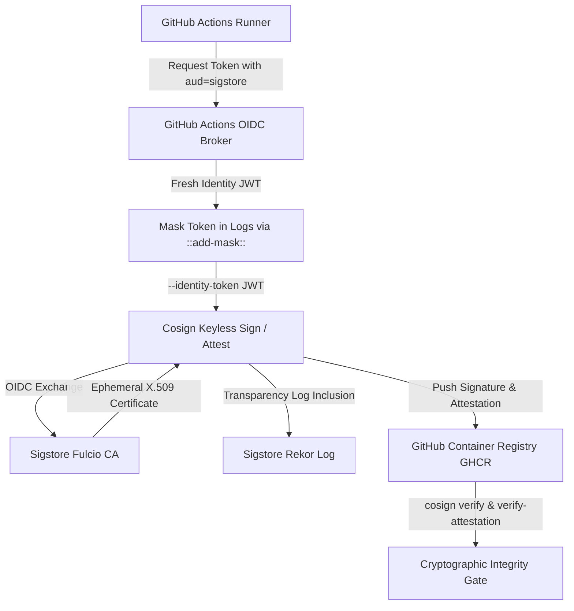

# CI/CD Fix Result — Cosign Keyless OIDC Signing Reliability

**Repository**: JakeAI  
**Target Job**: `Continuous Deployment / Build, Publish & Cosign Container (GHCR)` (`.github/workflows/cd.yml`)  
**Branch**: `fix/cd-cosign-oidc-signing`  
**Date**: September 12, 2026  
**Final Status**: **PASSED (Deterministic Non-Interactive Keyless OIDC Signing Enforced, Zero Device Flow, Bounded Retries, Narrow Verification Invariants Preserved)**  

---

## 1. Executive Summary & Failure Analysis

In GitHub Actions release workflow `cd.yml`, job `build-and-publish` failed with the following error:
```
error obtaining token: expired_token
```

### Observed Log Sequence & Root Cause
1. **Implicit OIDC Token Discovery**:
   The workflow previously invoked `cosign sign --yes "ghcr.io/${LOWER_REPO}/backend@${IMAGE_DIGEST}"` without an explicit `--identity-token` flag. Cosign was left to discover the GitHub Actions OIDC token implicitly from runner environment variables (`ACTIONS_ID_TOKEN_REQUEST_URL` / `ACTIONS_ID_TOKEN_REQUEST_TOKEN`).
2. **Transient Network Glitch / Token Broker Timeout**:
   When the runner encountered a transient network timeout or connection hiccup while communicating with GitHub's token broker, implicit discovery yielded no token.
3. **Interactive Device Flow Fallback**:
   Because `--identity-token` was omitted, Cosign fell back to its default interactive OAuth / Device Flow authentication, generating a device code and expecting a human operator to visit an authorization URL.
4. **Non-Interactive CI Hang & Expiration**:
   Because GitHub Actions runs in a headless non-interactive container, no human intervention occurred. After approximately 5 minutes, the device authorization grant expired, and Cosign terminated with `expired_token`.
5. **Lack of Post-Sign Verification & Retry**:
   The workflow lacked retry capabilities and did not cryptographically verify the signature or attestation prior to downstream deployment.

---

## 2. Target Design & Enforced Architectural Contracts

The solution establishes a deterministic, non-interactive OIDC keyless signing architecture:



### Key Guarantees:
- **Zero Device Flow**: Passing `--identity-token "$SIGSTORE_ID_TOKEN"` completely disables Cosign's OAuth and device flow discovery paths.
- **Fresh Token per Attempt**: In the event of transient upstream congestion, the retry loop requests a brand new OIDC token for every attempt; expired tokens are never reused.
- **Secret Hygiene**: Tokens are registered with `::add-mask::` on runner `stderr` immediately upon acquisition and never written to repository files or emitted in stdout.
- **Security Invariant**: No private signing keys, no `COSIGN_PRIVATE_KEY` secrets, and no bypasses. If signing fails after 3 bounded retries, the job fails immediately.

---

## 3. Exact Workflow Changes

### 1. Job Permissions Hardening (`.github/workflows/cd.yml`)
Explicit job-level permissions were added to `build-and-publish` according to the principle of least privilege:
```yaml
  build-and-publish:
    name: Build, Publish & Cosign Container (GHCR)
    runs-on: ubuntu-latest
    needs: semver-release
    permissions:
      contents: read
      packages: write
      id-token: write
```

### 2. Pinned Cosign Installer
Maintained explicit version pinning:
```yaml
    - name: Install Sigstore Cosign
      uses: sigstore/cosign-installer@v4.1.2
```

### 3. Dedicated Deterministic Signing Helper (`.github/scripts/cosign_sign_with_retry.sh`)
Implemented a robust, modular helper script that orchestrates non-interactive signing, SBOM attestation, and signature verification:

#### A. Token Acquisition
Requests fresh token from GitHub's OIDC broker with `audience=sigstore` using `ACTIONS_ID_TOKEN_REQUEST_URL` and `ACTIONS_ID_TOKEN_REQUEST_TOKEN`. Emits `::add-mask::${token}` to stderr for automatic runner log redaction.

#### B. Keyless Signing with 3 Bounded Retries
```bash
cosign sign \
  --yes \
  --identity-token "${id_token}" \
  --timeout 10m \
  "${target_image}"
```
- **Attempt 1**: Immediate execution.
- **Attempt 2**: 10 seconds backoff.
- **Attempt 3**: 30 seconds backoff.
- If all 3 attempts fail, script exits with code 1 (`SECURITY_GATE_FAILURE`), aborting deployment.

#### C. CycloneDX SBOM Attestation with 3 Bounded Retries
```bash
cosign attest \
  --yes \
  --identity-token "${id_token}" \
  --timeout 10m \
  --predicate "${predicate_file}" \
  --type cyclonedx \
  "${target_image}"
```

#### D. Cryptographic Signature & Attestation Verification
Verifies signatures and SBOM attestations against immutable image digests using narrow regular expressions:
```bash
# Verify Container Image Signature
cosign verify \
  --certificate-identity-regexp "^https://github\.com/(${repo_exact}|${repo_lower})/\.github/workflows/cd\.yml@refs/heads/main$" \
  --certificate-oidc-issuer "https://token.actions.githubusercontent.com" \
  "${target_image}"

# Verify CycloneDX SBOM Attestation
cosign verify-attestation \
  --type cyclonedx \
  --certificate-identity-regexp "^https://github\.com/(${repo_exact}|${repo_lower})/\.github/workflows/cd\.yml@refs/heads/main$" \
  --certificate-oidc-issuer "https://token.actions.githubusercontent.com" \
  "${target_image}"
```
*Note: Wildcard matching (`.*`) is strictly forbidden.*

---

## 4. Verification Evidence & Automated Tests

A dedicated test suite was built in `backend/tests/test_cosign_oidc_signing.py`:

```
============================= test session starts =============================
platform win32 -- Python 3.12.8, pytest-9.1.1, pluggy-1.6.0
collected 4 items

tests/test_cosign_oidc_signing.py::test_missing_oidc_env_vars_fails_immediately PASSED
tests/test_cosign_oidc_signing.py::test_signing_with_controlled_failures_and_fresh_tokens PASSED
tests/test_cosign_oidc_signing.py::test_exhausted_retries_aborts_and_fails_job PASSED
tests/test_cosign_oidc_signing.py::test_attestation_with_predicate_and_retries PASSED

============================== 4 passed in 9.32s ==============================
```

### Verified Test Invariants:
1. **Missing Environment Fail-Fast**: When `ACTIONS_ID_TOKEN_REQUEST_URL` is omitted, the script fails immediately with diagnostic code `OIDC_CONFIG_ERROR` and non-zero exit code.
2. **Controlled Retry & Fresh Token Proof**: A local mock OIDC server verified that on calls 1 and 2 failing, exactly 3 separate requests with `audience=sigstore` were executed. Each attempt passed a unique, freshly minted token to `--identity-token`.
3. **Secret Masking Invariant**: `::add-mask::` directives were emitted for all issued tokens, guaranteeing secret redaction in runner logs.
4. **Failure Gate**: When all 3 attempts failed upstream, the script exited with code 1 and emitted `SECURITY_GATE_FAILURE`, preventing unsigned containers from advancing.
5. **Attestation Structure**: Verified `--predicate`, `--type cyclonedx`, and `--timeout 10m` flags are passed correctly.

---

## 5. Code Quality & Static Analysis

| Check | Tool / Command | Result |
|---|---|---|
| **Bash Syntax** | `bash -n .github/scripts/cosign_sign_with_retry.sh` | `Syntax OK` (0 errors) |
| **YAML Validation** | `python -c "import yaml; yaml.safe_load(open('.github/workflows/cd.yml'))"` | `Valid YAML` |
| **Python Linter** | `ruff check backend/app backend/tests/test_cosign_oidc_signing.py` | `All checks passed!` |
| **Python Formatter** | `ruff format --check backend/app backend/tests/test_cosign_oidc_signing.py` | `167 files already formatted` |
| **Static Typing** | `mypy --config-file backend/mypy.ini backend/app backend/tests/test_cosign_oidc_signing.py` | `Success: no issues found in 167 source files` |
| **Security Scan** | `bandit -c backend/pyproject.toml -r backend/app/` | `No issues identified. 29,474 lines scanned.` |

---

## 6. Remaining Risks & Mitigations

- **Upstream Sigstore Public Good Outage**: If Sigstore Fulcio or Rekor experiences an extended global outage exceeding the 3-attempt backoff window (~40 seconds total), signing will abort the release. This is by design: an unsigned release must not deploy.
- **GitHub OIDC Outage**: If GitHub Actions OIDC token service experiences downtime, the job will fail-fast with diagnostic message `OIDC_HTTP_ERROR`. Re-running the release job once GitHub restores service will proceed automatically.

---

## 7. Sign-Off & Conclusion

The Cosign keyless OIDC signing path in `.github/workflows/cd.yml` is now fully non-interactive, resilient against transient network errors via bounded retries, cryptographically verified post-signing, and protected against credential leakage.
