# JakeAI Platform — Executable Repair Plan

> **Authoritative Engineering Plan for JakeAI Repair Operating System**  
> **Source Task:** REPAIR-02 — Repair Planning  
> **Created:** 2026-09-08  
> **Compliance:** Universal AI Engineering Worker & Repair Master Prompt  
> **Execution Strategy:** Correctness First → Infrastructure Second → Agent/RAG Third → Structural Consolidation  
> **Total Actionable Task Cards:** 21 across 5 workstreams  

---

## 1. Executive Summary & Architectural Principles

This document establishes the binding, executable Repair Plan for the JakeAI repository. Every task card in this plan maps directly to empirically verified findings from `docs/ai-engineering/state/repair-findings.md`. 

### Binding Repair Invariants
1. **Correctness Before Optimization:** Under no circumstances will caching or performance improvements precede functional correctness and request isolation.
2. **Architectural Prerequisite Before Dependent Repair:** Foundational abstractions (`ProviderRegistry`, `ProviderRequest`, `RedisConnectionManager`) must be repaired before modifying downstream consumers.
3. **No Parallel Work on Overlapping Contracts:** Tasks sharing module boundaries or public API schemas must execute sequentially to prevent merge collisions and contract drift.
4. **Invariant Protection:** No subsequent repair task may silently alter or weaken an invariant established by an earlier repair task.
5. **Zero Test Weakening:** Existing test assertions must never be suppressed, deleted, or weakened to make repairs pass.

---

## 2. Global Dependency Graph & Execution Sequence

```
====================================================================================================
                               JAKEAI GLOBAL REPAIR DEPENDENCY GRAPH
====================================================================================================

[Phase R3: Request / Inference Correctness]
  TASK-R1-01 (DUP-02: Model Routing) ──┐
                                       ├──> TASK-R1-03 (CACHE-01: Exact Cache Key)
  TASK-R1-02 (PROV-02: Messages List) ─┼──> TASK-R1-04 (TOK-02: Full-Envelope Accounting)
                                       │
[Phase R4: Infrastructure Correctness] ├──> TASK-R3-02 (PROV-04: Native SSE Streaming)
  TASK-R2-01 (DUP-01: Redis Lifecycle) ┼──> TASK-R2-03 (PERF-01: Atomic Quota Lua)
                                       │       │
  TASK-R2-02 (PROV-01: Pooled HTTP) ───┘       ├──> TASK-R5-06 (DUP-06: Unified Quota)
                                               │
[Phase R5: Agent & RAG Correctness]            │
  TASK-R3-01 (CACHE-03: Prefix Stability)      │
  TASK-R3-03 (AGT-01: Tool Output Budget) ──> TASK-R3-04 (AGT-03: Memory Compaction)
  TASK-R4-01 (RAG-01: Dense Embeddings)
  TASK-R4-02 (RAG-02: Telemetry Hygiene) ───> TASK-R4-03 (RAG-04: Context Accounting)

[Structural Consolidation]
  TASK-R5-01 (TYPE-01: Client Handle Types) ── depends on TASK-R2-01
  TASK-R5-02 (TYPE-02: Typed Tool Models)   ── depends on TASK-R1-02
  TASK-R5-03 (TYPE-03: Exception Hygiene)
  TASK-R5-04 (DUP-03: Pricing Catalog)
  TASK-R5-05 (DUP-04: BPETokenizer Hot Path) ── depends on TASK-R1-04
  TASK-R5-07 (BYOK-01: HKDF & CI-01 Coverage)
====================================================================================================
```

### Dependency Graph Specification (Mermaid)

```mermaid
flowchart TD
    subgraph R1["Workstream R1: Request & Inference Correctness (Phase R3)"]
        R1_01["TASK-R1-01: Model Routing (DUP-02)"]
        R1_02["TASK-R1-02: Structured Turns (PROV-02)"]
        R1_03["TASK-R1-03: Cache Key Isolation (CACHE-01, CACHE-02, CACHE-04)"]
        R1_04["TASK-R1-04: Full Token Accounting (TOK-02, TOK-03)"]
        
        R1_01 --> R1_03
        R1_02 --> R1_03
        R1_02 --> R1_04
    end

    subgraph R2["Workstream R2: Infrastructure Correctness (Phase R4)"]
        R2_01["TASK-R2-01: Centralized Redis (DUP-01, PERF-02)"]
        R2_02["TASK-R2-02: Pooled HTTP Client (PROV-01, PERF-02)"]
        R2_03["TASK-R2-03: Atomic Quota Lua (PERF-01)"]
        
        R2_01 --> R2_03
    end

    subgraph R3["Workstream R3: Streaming & Agent Correctness (Phase R5)"]
        R3_01["TASK-R3-01: Prefix Stability (CACHE-03)"]
        R3_02["TASK-R3-02: Native SSE Stream (PROV-04)"]
        R3_03["TASK-R3-03: Tool Output Budget (AGT-01, AGT-02)"]
        R3_04["TASK-R3-04: Memory Compaction (AGT-03)"]
        
        R1_02 --> R3_02
        R2_02 --> R3_02
        R3_03 --> R3_04
    end

    subgraph R4["Workstream R4: RAG Correctness (Phase R5)"]
        R4_01["TASK-R4-01: Pluggable Embeddings (RAG-01, DUP-05)"]
        R4_02["TASK-R4-02: Telemetry Hygiene (RAG-02)"]
        R4_03["TASK-R4-03: Context Accounting (RAG-04, RAG-03, PERF-03)"]
        
        R4_02 --> R4_03
    end

    subgraph R5["Workstream R5: Structural Repair"]
        R5_01["TASK-R5-01: Client Typing (TYPE-01)"]
        R5_02["TASK-R5-02: Typed Schemas (TYPE-02)"]
        R5_03["TASK-R5-03: Exception Hygiene (TYPE-03)"]
        R5_04["TASK-R5-04: Pricing Catalog (DUP-03)"]
        R5_05["TASK-R5-05: BPETokenizer Path (DUP-04, TOK-01)"]
        R5_06["TASK-R5-06: Unified Quota (DUP-06)"]
        R5_07["TASK-R5-07: HKDF & Coverage (BYOK-01, CI-01)"]
        
        R2_01 --> R5_01
        R1_02 --> R5_02
        R1_04 --> R5_05
        R2_03 --> R5_06
    end
```



---

## 3. Workstream Execution Plans & Detailed Task Cards

---

### R1 — Request / Inference Correctness

This workstream restores semantic integrity, role boundary separation, cache key partitioning, and truthful token accounting. It is executed under Phase **REPAIR-03**.

---

#### TASK-R1-01: Canonical Model-to-Provider Resolution
- **TASK ID:** `TASK-R1-01`
- **PRIMARY FINDING:** `DUP-02`
- **OBJECTIVE:** Eliminate hardcoded, out-of-sync substring heuristics in `ai_gateway.py` and route all model-to-provider mappings through `ProviderRegistry.resolve_provider_name_for_model()`.
- **WHY NOW:** Immediate P0 unblocker. Without correct provider resolution, DeepSeek and Groq models misroute to OpenRouter, breaking BYOK tenant key injection and preventing downstream cache key partitioning.
- **DEPENDENCIES:** None.
- **AFFECTED FILES:**
  - `backend/app/services/ai_gateway.py` (lines 342–350, 606)
  - `backend/app/core/llm_provider.py`
  - `backend/app/providers/registry.py`
- **INVARIANT:** Model-to-provider resolution MUST have exactly one authoritative implementation: `ProviderRegistry.resolve_provider_name_for_model(model_name)`. Any known model (`deepseek-*`, `llama-*`, `groq/*`) must resolve to its authentic provider adapter.
- **REGRESSION TEST:** `backend/tests/unit/test_ai_gateway_routing.py`
  - Submit `chat_completions` request with `model="deepseek-chat"`.
  - Assert that resolved provider is `"deepseek"` and `byok_manager.get_api_key(tenant_id, "deepseek")` is requested.
  - Submit `chat_completions` request with `model="llama-3.3-70b-versatile"`. Assert resolved provider is `"groq"`.
- **SECURITY REQUIREMENTS:** Ensure tenant BYOK keys for direct providers are strictly isolated and never sent to fallback providers unless explicitly configured in tenant failover policy.
- **OBSERVABILITY REQUIREMENTS:** Emit structured log event `provider_resolved` with `model`, `provider`, and `tenant_id`.
- **ACCEPTANCE CRITERIA:**
  1. Lines 342–350 in `ai_gateway.py` deleted in favor of `get_provider_registry().resolve_provider_name_for_model(request.model)`.
  2. `deepseek-chat` and `llama-3.1-8b-instant` resolve to `"deepseek"` and `"groq"` respectively.
  3. All existing gateway tests pass.
- **FORBIDDEN CHANGES:** Do not alter the provider adapter implementations or rename existing provider identifiers (`"gemini"`, `"openai"`, `"anthropic"`, `"openrouter"`, `"deepseek"`, `"groq"`).

---

#### TASK-R1-02: Structured Multi-Turn Messages in ProviderRequest
- **TASK ID:** `TASK-R1-02`
- **PRIMARY FINDING:** `PROV-02`
- **OBJECTIVE:** Add native multi-turn conversation support (`messages: list[ChatMessage]`) to `ProviderRequest` and update all 6 provider adapters to forward structured turns to upstream APIs.
- **WHY NOW:** Foundational correctness prerequisite. Upstream LLMs currently receive flattened text strings or single user prompts, destroying conversational memory and role boundaries.
- **DEPENDENCIES:** None. Unblocks `TASK-R1-03` and `TASK-R1-04`.
- **AFFECTED FILES:**
  - `backend/app/providers/base.py` (`ProviderRequest`, lines 132–162)
  - `backend/app/providers/openai.py` (lines 96–102)
  - `backend/app/providers/anthropic.py`
  - `backend/app/providers/gemini.py`
  - `backend/app/providers/groq.py`
  - `backend/app/providers/deepseek.py`
  - `backend/app/providers/openrouter.py`
  - `backend/app/services/ai_gateway.py` (line 284)
- **INVARIANT:** `ProviderRequest` MUST accept structured conversation turns (`messages: list[ChatMessage] | None = None`). When `messages` is provided, provider adapters MUST preserve native role designations (`user`, `assistant`, `tool`) in upstream HTTP payloads.
- **REGRESSION TEST:** `backend/tests/unit/test_provider_multiturn.py`
  - Dispatch a 3-turn message list (`[ChatMessage(role="user", content="Hi"), ChatMessage(role="assistant", content="Hello!"), ChatMessage(role="user", content="What did I just say?")]`) to each of the 6 provider adapters.
  - Assert that serialized upstream JSON payload contains all 3 turns with corresponding roles.
- **SECURITY REQUIREMENTS:** Enforce role validation: prevent user-controlled injection of synthetic `system` or `tool` turns without appropriate authorization.
- **OBSERVABILITY REQUIREMENTS:** Record `turn_count` in provider invocation span metadata.
- **ACCEPTANCE CRITERIA:**
  1. `ProviderRequest` contains `messages: list[ChatMessage] | None = None`.
  2. All 6 provider adapters serialize `messages` into upstream vendor wire formats when present, falling back to `prompt` when `messages` is `None`.
  3. `ai_gateway.py` forwards full `request.messages` to `ProviderRequest`.
  4. All existing provider tests pass without regressions.
- **FORBIDDEN CHANGES:** Do not remove the legacy `prompt: str` attribute from `ProviderRequest` (preserve backward compatibility for single-prompt callers).

---

#### TASK-R1-03: Composite Exact Response Cache Key Isolation
- **TASK ID:** `TASK-R1-03`
- **PRIMARY FINDINGS:** `CACHE-01`, `CACHE-02`, `CACHE-04`
- **OBJECTIVE:** Construct exact and semantic cache keys from a complete composite execution envelope, incorporating tenant, provider, model, version, system prompt hash, conversation turns hash, query, tools hash, and temperature.
- **WHY NOW:** Prevents critical cross-conversation, cross-model response pollution and security leaks.
- **DEPENDENCIES:** `TASK-R1-01` (Provider Resolution), `TASK-R1-02` (Structured Turns).
- **AFFECTED FILES:**
  - `backend/app/services/ai_gateway.py` (lines 284–289, 459–463)
  - `backend/app/optimizer/semantic_cache.py` (lines 198, 214–221)
  - `backend/app/providers/openai.py` (lines 104–115)
- **INVARIANT:** Different semantic request identities MUST produce distinct exact cache keys. Formally:
  $$\text{Key} = \text{SHA256}(\text{tenant\_id} \parallel \text{provider} \parallel \text{model} \parallel \text{temp} \parallel H(\text{system}) \parallel H(\text{history}) \parallel \text{query} \parallel H(\text{tools}))$$
  Requests differing in ANY of these parameters must never collide.
- **REGRESSION TEST:** `backend/tests/unit/test_exact_cache_isolation.py`
  - Send Request A (`model="gpt-4o"`, `prompt="Hello"`).
  - Send Request B (`model="claude-3-5-sonnet"`, `prompt="Hello"`).
  - Assert Request B produces a cache MISS and executes provider inference.
  - Send Request C (`model="gpt-4o"`, `system="You are an accountant"`, `prompt="Hello"`).
  - Assert Request C produces a cache MISS.
- **SECURITY REQUIREMENTS:** Cross-tenant cache hit probability must be mathematically 0. Prevent prompt injection leakage from private user conversations.
- **OBSERVABILITY REQUIREMENTS:** Log cache lookup metrics with attributes: `cache_hit: bool`, `cache_tier: "exact" | "semantic"`, `key_hash_prefix`.
- **ACCEPTANCE CRITERIA:**
  1. `ai_gateway.py:289` and `459` compute composite cache keys.
  2. `semantic_cache.py` incorporates execution `parameters` (temperature, tools) into lookup and indexing.
  3. `openai.py` passes `prompt_cache_key` when static prefix hash is available (`CACHE-04`).
- **FORBIDDEN CHANGES:** Do not disable caching or bypass Redis tier. Do not alter cache expiration TTL settings.

---

#### TASK-R1-04: Full-Envelope Model-Visible Token Accounting
- **TASK ID:** `TASK-R1-04`
- **PRIMARY FINDINGS:** `TOK-02`, `TOK-03`
- **OBJECTIVE:** Calculate `raw_prompt_tokens` across all model-visible inputs (`request.messages`, `system_instruction`, tool schemas, and query) and segregate physical pruning savings from upstream provider cache discounts.
- **WHY NOW:** Eliminates tenant quota evasion (up to 95% unbilled tokens on long conversations) and prevents financial loss.
- **DEPENDENCIES:** `TASK-R1-02` (Structured Turns in ProviderRequest).
- **AFFECTED FILES:**
  - `backend/app/services/ai_gateway.py` (lines 291, 358–361, 433–436, 466–470)
  - `backend/app/optimizer/token_accounting.py` (lines 128–157)
  - `backend/app/finops/service.py`
- **INVARIANT:** `raw_prompt_tokens` MUST reflect all tokens that will be visible to the upstream model. Quota deductions and FinOps ledgers MUST record:
  $$\text{Total Visible Tokens} = \text{tokens}(\text{system}) + \sum_{m \in \text{messages}} \text{tokens}(m) + \text{tokens}(\text{tools})$$
  Physical pruning savings and provider cache discounts must be recorded in separate ledger fields.
- **REGRESSION TEST:** `backend/tests/unit/test_token_accounting_envelope.py`
  - Dispatch a request with 1,000-token system instruction, 500-token conversation history, and 50-token query.
  - Assert `record.raw_prompt_tokens >= 1550`.
  - Assert quota deduction reflects full 1,550 tokens (minus validated pruning reductions).
- **SECURITY REQUIREMENTS:** Prevent rate limit and token quota bypass via long-context multi-turn conversation flooding.
- **OBSERVABILITY REQUIREMENTS:** Publish metric `tokens.raw_envelope_count`, `tokens.pruned_count`, `tokens.provider_cached_count`.
- **ACCEPTANCE CRITERIA:**
  1. `ai_gateway.py:291` computes tokens over the entire message list and system prompt.
  2. `token_accounting.py` separates `physical_pruned_tokens` and `provider_cached_tokens`.
  3. Portfolio benchmark maintains quality $\ge 0.95$ and net token reduction $\ge 40\%$.
- **FORBIDDEN CHANGES:** Do not alter the baseline pricing formulas in `app.finops.pricing` during this task (pricing consolidation is handled in `TASK-R5-04`).

---

### R2 — Infrastructure Correctness

This workstream unifies connection management, prevents TCP socket exhaustion, and guarantees atomic token quota reservations. It is executed under Phase **REPAIR-04**.

---

#### TASK-R2-01: Centralized Redis Connection Lifecycle Manager
- **TASK ID:** `TASK-R2-01`
- **PRIMARY FINDINGS:** `DUP-01`, `PERF-02`
- **OBJECTIVE:** Centralize Redis connection instantiation into `app.core.redis.RedisConnectionManager` and bind its lifecycle strictly to FastAPI `lifespan`.
- **WHY NOW:** 9 separate modules currently spawn uncoordinated Redis connection pools. Application shutdown cleans up only 3, leaking connections and leaving unclosed sockets.
- **DEPENDENCIES:** None. Unblocks `TASK-R2-03`, `TASK-R5-01`, and `TASK-R5-06`.
- **AFFECTED FILES:**
  - `backend/app/core/redis.py` (New / Consolidated singleton manager)
  - `backend/app/main.py` (lines 45–55, lifespan shutdown)
  - `backend/app/core/health.py`
  - `backend/app/core/security.py`
  - `backend/app/core/byok.py`
  - `backend/app/core/rate_limiter.py`
  - `backend/app/core/tasks.py`
  - `backend/app/finops/budget.py`
  - `backend/app/rag/resume_bridge.py`
  - `backend/app/services/ai_gateway.py`
  - `backend/app/optimizer/semantic_cache.py`
- **INVARIANT:** Shared Redis connections MUST have exactly one lifecycle owner (`RedisConnectionManager`) initialized at application startup and cleanly closed at application shutdown.
- **REGRESSION TEST:** `backend/tests/unit/test_redis_lifecycle.py`
  - Initialize FastAPI TestClient with lifespan context.
  - Assert that all storage-dependent services share the same `redis.asyncio.ConnectionPool`.
  - Exit lifespan context. Assert connection pool `disconnect()` is awaited and 0 unclosed socket warnings are emitted.
- **SECURITY REQUIREMENTS:** Preserve tenant key prefix isolation (`tenant:{id}:*`) across all Redis operations.
- **OBSERVABILITY REQUIREMENTS:** Export Redis connection pool metrics: `redis_pool_size`, `redis_pool_available`, `redis_pool_in_use`.
- **ACCEPTANCE CRITERIA:**
  1. Single authoritative `RedisConnectionManager` created in `app/core/redis.py`.
  2. All 9 modules obtain Redis clients from `get_redis_client()`.
  3. `main.py` `lifespan` cleanly disconnects the shared pool.
  4. 0 connection leak warnings on application exit.
- **FORBIDDEN CHANGES:** Do not remove existing fallback mechanisms that handle Redis connection unavailability in development/offline modes.

---

#### TASK-R2-02: Application-Scoped Pooled HTTP Client
- **TASK ID:** `TASK-R2-02`
- **PRIMARY FINDINGS:** `PROV-01`, `PERF-02`
- **OBJECTIVE:** Replace per-request `httpx.AsyncClient` instantiation in `core/llm_provider.py` with an application-scoped singleton HTTP client pool bound to FastAPI `lifespan`.
- **WHY NOW:** Creating a new client per request adds 50–150ms unnecessary TLS latency and causes TCP port exhaustion (`TIME_WAIT`) under high request rates.
- **DEPENDENCIES:** None. Unblocks `TASK-R3-02`.
- **AFFECTED FILES:**
  - `backend/app/core/http_client.py` (New / Centralized HTTP pool manager)
  - `backend/app/core/llm_provider.py` (line 142)
  - `backend/app/main.py` (lifespan startup/shutdown)
- **INVARIANT:** Outbound HTTP transport to upstream LLM providers MUST reuse an application-scoped, pooled `httpx.AsyncClient` with configured keep-alive, connection limits, and deterministic shutdown.
- **REGRESSION TEST:** `backend/tests/unit/test_http_pooling.py`
  - Issue 10 consecutive mock upstream requests through `call_upstream_llm_detailed`.
  - Assert that the exact same `httpx.AsyncClient` instance was utilized for all 10 dispatches.
  - Trigger lifespan shutdown; assert client `.aclose()` was called.
- **SECURITY REQUIREMENTS:** Outbound transport must enforce TLS certificate verification and respect proxy/timeout settings.
- **OBSERVABILITY REQUIREMENTS:** Track `http_client_active_connections`, `http_client_pooled_connections`.
- **ACCEPTANCE CRITERIA:**
  1. `get_http_client()` provides pooled `httpx.AsyncClient` with limits (`max_keepalive_connections=20`, `max_connections=100`).
  2. `llm_provider.py` no longer uses `async with httpx.AsyncClient(...)` per invocation.
  3. Client pool closes cleanly in `main.py` lifespan.
- **FORBIDDEN CHANGES:** Do not alter provider-specific HTTP headers, auth tokens, or endpoint URLs.

---

#### TASK-R2-03: Atomic Concurrency Quota Reservation via Redis Lua
- **TASK ID:** `TASK-R2-03`
- **PRIMARY FINDING:** `PERF-01`
- **OBJECTIVE:** Implement atomic token check-and-reserve semantics using a Redis Lua script, eliminating race conditions that allow concurrent requests to breach tenant quotas.
- **WHY NOW:** Tenants can currently exceed contractual token limits by issuing simultaneous parallel requests that bypass check-then-act `GET`/`INCRBY` logic.
- **DEPENDENCIES:** `TASK-R2-01` (Centralized Redis Manager).
- **AFFECTED FILES:**
  - `backend/app/services/ai_gateway.py` (`QuotaManager`, lines 172–219)
  - `backend/app/finops/budget.py` (`BudgetManager`)
  - `backend/app/core/scripts/check_and_reserve.lua` (New atomic script)
- **INVARIANT:** Quota verification and token allocation MUST execute as an indivisible atomic operation. If requested tokens exceed remaining budget, reservation MUST fail immediately without partial allocation.
- **REGRESSION TEST:** `backend/tests/unit/test_atomic_quota.py`
  - Set tenant remaining quota to 1,000 tokens.
  - Launch 10 concurrent async tasks, each requesting a reservation of 200 tokens.
  - Assert that exactly 5 tasks succeed (reserving 1,000 tokens total) and 5 tasks receive HTTP 429 Quota Exceeded.
- **SECURITY REQUIREMENTS:** Protect against quota starvation and financial leakage. Prevent negative token balance exploits.
- **OBSERVABILITY REQUIREMENTS:** Emit metric `quota.reservations_total{status="allowed|denied"}` and log reservation latency.
- **ACCEPTANCE CRITERIA:**
  1. Atomic Redis Lua script `check_and_reserve.lua` implemented and registered in Redis client.
  2. Gateway calls atomic reservation before inference begins.
  3. Settle / reconciliation logic adjusts reserved tokens to actual billed tokens upon completion.
  4. Unused reservations are released on upstream inference failure.
- **FORBIDDEN CHANGES:** Do not bypass quota checks for unauthenticated or test requests.

---

### R3 — Streaming / Agent Correctness

This workstream repairs streaming response delivery, restores agent prompt cache stability, bounds tool execution outputs, and protects critical user constraints from memory amnesia. It is executed under Phase **REPAIR-05**.

---

#### TASK-R3-01: Static System Instruction Prefix Stability in Agent Planner
- **TASK ID:** `TASK-R3-01`
- **PRIMARY FINDING:** `CACHE-03`
- **OBJECTIVE:** Remove dynamic iteration counters (`Current iteration: {i}`) from the agent planner's system instruction, placing iteration metadata in dynamic context or turn history.
- **WHY NOW:** The mutating system prompt completely destroys upstream prompt caching (Anthropic / OpenAI prefix cache) on every agent iteration, multiplying cost and latency.
- **DEPENDENCIES:** None.
- **AFFECTED FILES:**
  - `backend/app/agent/planning/planner.py` (lines 110–124)
- **INVARIANT:** The agent `system_instruction` text MUST remain byte-for-byte identical across all iterations ($0 \dots N$) of an agent execution loop.
- **REGRESSION TEST:** `backend/tests/unit/test_agent_prefix_stability.py`
  - Execute a 3-step agent task using `BoundedPlanner`.
  - Capture `system_instruction` string generated at step 0, step 1, and step 2.
  - Assert: `sys_0 == sys_1 == sys_2`.
  - Assert that iteration metadata is present in the latest execution turn.
- **SECURITY REQUIREMENTS:** Ensure planner security rules, sandbox restrictions, and tool boundaries in system instructions remain immutable.
- **OBSERVABILITY REQUIREMENTS:** Tag agent prompt spans with `static_prefix_hash` to prove cache hit eligibility.
- **ACCEPTANCE CRITERIA:**
  1. `BoundedPlanner.determine_next_action` produces a byte-stable system prompt.
  2. Dynamic step counter formatted as `[Execution Context: step {i+1} of {max}]` in dynamic message history.
  3. All agent evaluation tests pass.
- **FORBIDDEN CHANGES:** Do not modify agent max iteration limits, stopping conditions, or tool choice logic.

---

#### TASK-R3-02: Native SSE Event-Stream Yielding in AI Gateway
- **TASK ID:** `TASK-R3-02`
- **PRIMARY FINDING:** `PROV-04`
- **OBJECTIVE:** Replace the simulated word-delay loop (`asyncio.sleep(0.002)`) in `chat_completions_stream` with true native streaming yielded directly from upstream provider response streams.
- **WHY NOW:** Fake streaming forces a 5–10 second delay before the first token is sent, negating all user-facing TTFT benefits of streaming.
- **DEPENDENCIES:** `TASK-R1-02` (Structured ProviderRequest), `TASK-R2-02` (Pooled HTTP Client).
- **AFFECTED FILES:**
  - `backend/app/services/ai_gateway.py` (lines 605–643)
  - `backend/app/providers/base.py`
- **INVARIANT:** `chat_completions_stream` MUST yield Server-Sent Events (SSE) incrementally as raw chunks arrive from the upstream provider socket, with TTFT strictly decoupling from full completion latency.
- **REGRESSION TEST:** `backend/tests/unit/test_gateway_streaming.py`
  - Mock an upstream provider streaming 10 chunks at 100ms intervals.
  - Connect to `chat_completions_stream` generator.
  - Assert that the first chunk is received by the caller at $\approx 100\text{ms}$, long before completion finishes.
- **SECURITY REQUIREMENTS:** Ensure client disconnection cancels upstream HTTP request immediately, preventing orphaned token billing.
- **OBSERVABILITY REQUIREMENTS:** Record `time_to_first_token_ms` (TTFT) and `total_streaming_duration_ms`.
- **ACCEPTANCE CRITERIA:**
  1. Simulated word-split loop and sleep deleted from `ai_gateway.py`.
  2. Upstream provider `.stream()` generator consumed and transformed into SSE formatted chunks.
  3. Client disconnect properly handled via `asyncio.CancelledError`.
- **FORBIDDEN CHANGES:** Do not break the OpenAI-compatible `data: {"choices": [{"delta": ...}]}` SSE wire format.

---

#### TASK-R3-03: Tool Output Token Budgeting & Sanitization
- **TASK ID:** `TASK-R3-03`
- **PRIMARY FINDINGS:** `AGT-01`, `AGT-02`
- **OBJECTIVE:** Enforce an explicit token budget ($\le 2,000$ tokens / 8,000 characters) on tool execution observations before appending them to agent short-term memory, adding structured truncation notices and pagination metadata.
- **WHY NOW:** Massive tool execution outputs (e.g. database dumps, raw HTML, large file contents) currently blow past model context windows, degrading attention and exhausting budgets.
- **DEPENDENCIES:** None. Unblocks `TASK-R3-04`.
- **AFFECTED FILES:**
  - `backend/app/agent/runtime/loop.py` (lines 250–263)
  - `backend/app/agent/memory/short_term.py`
- **INVARIANT:** Tool observation messages ingested into agent memory MUST NOT exceed the configured maximum observation token budget ($B_{\text{obs}} = 2,000$ tokens). Truncated outputs must retain head/tail context and explicit truncation markers.
- **REGRESSION TEST:** `backend/tests/unit/test_tool_output_budgeting.py`
  - Execute a tool returning a 100,000-character JSON payload.
  - Check the observation message added to `short_term_mem`.
  - Assert that observation token count is $\le 2,000$ tokens and contains `[Truncated: 92,000 characters omitted]`.
- **SECURITY REQUIREMENTS:** Redact potential secret keys or authorization tokens present in tool observation strings before appending to memory.
- **OBSERVABILITY REQUIREMENTS:** Log warning event `tool_output_truncated` with `tool_name`, `original_chars`, `truncated_chars`.
- **ACCEPTANCE CRITERIA:**
  1. Tool observations passing through `loop.py` sanitized and budgeted.
  2. Large tool outputs gracefully truncated without breaking JSON structure if possible.
  3. Agent continues task without context exhaustion errors.
- **FORBIDDEN CHANGES:** Do not discard tool execution status or error indicators.

---

#### TASK-R3-04: Constraint-Preserving Agent Memory Compaction
- **TASK ID:** `TASK-R3-04`
- **PRIMARY FINDING:** `AGT-03`
- **OBJECTIVE:** Replace naive FIFO message popping (`>50`) in `ShortTermMemory` with an invariant-preserving compaction strategy that permanently preserves initial user task instructions and constraints while pruning stale intermediate observations.
- **WHY NOW:** Long-running agent tasks currently drop the root user prompt after 50 turns, causing severe task divergence and instruction amnesia.
- **DEPENDENCIES:** `TASK-R3-03` (Tool Output Budgeting).
- **AFFECTED FILES:**
  - `backend/app/agent/memory/short_term.py` (lines 28–36)
- **INVARIANT:** Initial user prompt messages containing task instructions and constraints MUST NEVER be evicted during memory compaction. Eviction must strictly target obsolete intermediate tool observations.
- **REGRESSION TEST:** `backend/tests/unit/test_memory_compaction.py`
  - Instantiate `ShortTermMemory` and insert Turn 1 user message: `"Critical Rule: Do not modify schema.sql"`.
  - Append 60 intermediate tool execution turns.
  - Inspect `memory.get_messages()`.
  - Assert that Turn 1 user message remains present at index 0.
- **SECURITY REQUIREMENTS:** Safety boundaries and negative constraints set by the user must remain immutable across arbitrarily long agent execution traces.
- **OBSERVABILITY REQUIREMENTS:** Record `memory_compaction_events_total` and `tokens_compacted_total`.
- **ACCEPTANCE CRITERIA:**
  1. Naive `self._messages.pop(0)` deleted.
  2. Compaction policy pins system prompt and root user prompt.
  3. Intermediate observations pruned based on staleness and token size.
- **FORBIDDEN CHANGES:** Do not alter the public interface of `ShortTermMemory` (`add_message`, `get_messages`, `clear`).

---

### R4 — RAG Correctness

This workstream replaces avalanche-sensitive hash vectors with true semantic embeddings, cleanses internal scoring telemetry from LLM prompt context, and fixes context token accounting. It is executed under Phase **REPAIR-05**.

---

#### TASK-R4-01: Pluggable EmbeddingProvider Abstraction & Dense Retrieval Remediation
- **TASK ID:** `TASK-R4-01`
- **PRIMARY FINDINGS:** `RAG-01`, `DUP-05`
- **OBJECTIVE:** Replace SHA-256 seed struct unpack vectors in `vector_store.py` and MD5 bag-of-words vectors in `semantic_cache.py` with an authoritative `EmbeddingProvider` Protocol supporting deterministic offline embeddings and remote provider embeddings.
- **WHY NOW:** Dense retrieval is currently semantically blind because cryptographic hashes produce orthogonal vectors for semantically equivalent text.
- **DEPENDENCIES:** None.
- **AFFECTED FILES:**
  - `backend/app/core/embeddings.py` (New authoritative embedding interface)
  - `backend/app/rag/vector_store.py` (lines 12–28)
  - `backend/app/optimizer/semantic_cache.py` (line 85)
- **INVARIANT:** Dense vector embeddings MUST reflect semantic similarity: semantically equivalent texts MUST produce cosine similarity $\ge 0.80$, while semantically unrelated texts MUST produce cosine similarity $< 0.40$.
- **REGRESSION TEST:** `backend/tests/unit/test_dense_embeddings.py`
  - Compute embeddings for Text A: `"Quarterly revenue grew by 15%"` and Text B: `"Sales increased by fifteen percent"`.
  - Assert `cosine_similarity(vec_a, vec_b) >= 0.80`.
  - Compute embedding for Text C: `"The recipe requires two cups of flour"`.
  - Assert `cosine_similarity(vec_a, vec_c) < 0.40`.
- **SECURITY REQUIREMENTS:** Embedding generation must respect tenant isolation and avoid logging raw text chunks.
- **OBSERVABILITY REQUIREMENTS:** Track `embedding_latency_ms` and `embedding_token_count`.
- **ACCEPTANCE CRITERIA:**
  1. `EmbeddingProvider` protocol created with fast deterministic local adapter (e.g. normalized character n-gram / TF-IDF projection) and remote adapter interface.
  2. `vector_store.py` and `semantic_cache.py` unified under the new abstraction (`DUP-05`).
  3. Avalanche-sensitive SHA-256 and MD5 generators removed.
- **FORBIDDEN CHANGES:** Do not require external paid API calls for default offline test execution; test suite must run fully deterministic offline.

---

#### TASK-R4-02: Elimination of Score Leakage in Formatted RAG Prompt Context
- **TASK ID:** `TASK-R4-02`
- **PRIMARY FINDING:** `RAG-02`
- **OBJECTIVE:** Remove internal floating-point retrieval scores (`(Score: 0.87)`) from formatted LLM prompt context strings in `context_selector.py`, keeping scores exclusively in metadata.
- **WHY NOW:** Formatting internal floating-point numbers into the prompt text wastes tokens, pollutes generation context, and prevents upstream prompt caching across queries with slight score variances.
- **DEPENDENCIES:** None. Unblocks `TASK-R4-03`.
- **AFFECTED FILES:**
  - `backend/app/rag/context_selector.py` (lines 288–291)
- **INVARIANT:** Text formatted for LLM prompt context MUST contain only citation index, source identifier, and retrieved content. Internal scoring telemetry MUST NOT be injected into prompt text.
- **REGRESSION TEST:** `backend/tests/unit/test_rag_prompt_formatting.py`
  - Select context for 3 sample chunks.
  - Inspect `result.formatted_context`.
  - Assert that `(Score:` does not appear anywhere in the string.
  - Assert that chunk scores remain accessible in `result.selected_chunks[i].score`.
- **SECURITY REQUIREMENTS:** Ensure source labels are sanitized against prompt injection.
- **OBSERVABILITY REQUIREMENTS:** Maintain retrieval score tracking in OpenTelemetry span attributes.
- **ACCEPTANCE CRITERIA:**
  1. `(Score: {chunk.score:.2f})` removed from line 289 of `context_selector.py`.
  2. Existing RAG tests updated and passing.
- **FORBIDDEN CHANGES:** Do not remove source identifiers or citation indices (`[1] Source: ...`).

---

#### TASK-R4-03: Accurate Formatted RAG Context Accounting & Algorithmic Optimization
- **TASK ID:** `TASK-R4-03`
- **PRIMARY FINDINGS:** `RAG-04`, `RAG-03`, `PERF-03`
- **OBJECTIVE:** Calculate selected context tokens against the final formatted string (including headers), replace $O(N \log N)$ sorting with $O(N \log K)$ heap selection, and eliminate repeated intermediate string allocations.
- **WHY NOW:** Selected context tokens are currently undercounted by 5–10% because citation headers are ignored, risking context overflow.
- **DEPENDENCIES:** `TASK-R4-02` (Clean prompt formatting).
- **AFFECTED FILES:**
  - `backend/app/rag/context_selector.py` (lines 199, 216, 294–295)
- **INVARIANT:** `selected_tokens` MUST match `estimate_tokens(formatted_context)`. Top-$K$ candidate selection must be numerically identical while executing in $O(N \log K)$ time.
- **REGRESSION TEST:** `backend/tests/unit/test_rag_accounting.py`
  - Run `select_context` with 5 chunks and a strict token budget.
  - Assert `result.selected_tokens == estimate_tokens(result.formatted_context)`.
  - Verify heap selection yields chunks sorted in descending relevance.
- **SECURITY REQUIREMENTS:** None.
- **OBSERVABILITY REQUIREMENTS:** Report `rag_candidates_considered`, `rag_chunks_selected`.
- **ACCEPTANCE CRITERIA:**
  1. `selected_tokens = estimate_tokens(formatted_context)` implemented.
  2. `heapq.nlargest` replaces `sort()` on candidate pools.
  3. Redundant `"\n\n".join(...)` calls removed from token counting loops.
- **FORBIDDEN CHANGES:** Do not alter relevance scoring thresholds or tie-breaking logic.

---

### R5 — Structural Repair

This workstream enforces strict static typing on I/O boundaries, removes duplicated pricing catalogs, canonicalizes token counting under `BPETokenizer`, unifies quota governance, and hardens BYOK key derivation.

---

#### TASK-R5-01: Strict Static Typing on Infrastructure Handles
- **TASK ID:** `TASK-R5-01`
- **PRIMARY FINDING:** `TYPE-01`
- **OBJECTIVE:** Replace `Any | None` type annotations on infrastructure handles (`redis_client`, `raw_request`, `_client`, `cancellation_requested`) with explicit protocol and class types under `if TYPE_CHECKING:`.
- **WHY NOW:** Permissive typing disables static type verification on critical I/O and network boundaries, risking runtime attribute errors.
- **DEPENDENCIES:** `TASK-R2-01` (Centralized Redis Client).
- **AFFECTED FILES:**
  - `backend/app/services/ai_gateway.py` (lines 100, 519)
  - `backend/app/core/byok.py` (line 47)
  - `backend/app/rag/vector_store.py` (line 51)
  - `backend/app/agent/runtime/loop.py` (line 57)
- **INVARIANT:** All infrastructure client attributes MUST be strictly typed using concrete types (`Redis | None`, `Request | None`, `AsyncQdrantClient | None`) without triggering circular imports.
- **REGRESSION TEST:** `uv run --project backend mypy --config-file backend/mypy.ini backend/app`
  - Mypy strictly passes with 0 type errors and 0 untyped defs.
- **SECURITY REQUIREMENTS:** None.
- **OBSERVABILITY REQUIREMENTS:** None.
- **ACCEPTANCE CRITERIA:**
  1. `Any | None` replaced with strict types across all 4 files.
  2. MyPy passes across 141 files with 0 warnings.
- **FORBIDDEN CHANGES:** Do not introduce runtime circular imports or use `# type: ignore` comments.

---

#### TASK-R5-02: Strongly-Typed Tool Schemas, Arguments, and Choices
- **TASK ID:** `TASK-R5-02`
- **PRIMARY FINDING:** `TYPE-02`
- **OBJECTIVE:** Define typed Pydantic models / TypedDicts for tool definitions, function parameters, and gateway choices instead of untyped `dict[str, Any]`.
- **WHY NOW:** Untyped dictionaries allow malformed tool definitions and invalid function schemas to reach provider adapters, producing runtime 400 Bad Request errors.
- **DEPENDENCIES:** `TASK-R1-02` (ProviderRequest schema).
- **AFFECTED FILES:**
  - `backend/app/providers/base.py` (lines 145, 153, 160)
  - `backend/app/agent/planning/models.py` (line 24)
  - `backend/app/services/ai_gateway.py` (line 86)
- **INVARIANT:** Tool schemas, function call arguments, and chat completion choices MUST validate against explicit Pydantic / TypedDict models.
- **REGRESSION TEST:** `backend/tests/unit/test_typed_schemas.py`
  - Attempt to instantiate a `ToolDefinition` with invalid schema types.
  - Assert validation error is raised during construction before reaching provider adapters.
- **SECURITY REQUIREMENTS:** Validate that tool schemas conform to OpenAI/Anthropic function calling constraints, rejecting recursive or oversized schemas.
- **OBSERVABILITY REQUIREMENTS:** None.
- **ACCEPTANCE CRITERIA:**
  1. `ToolDefinition`, `FunctionCall`, and `ChatChoice` schemas defined and applied.
  2. Provider adapters accept typed schemas while supporting dict conversion for backward compatibility.
- **FORBIDDEN CHANGES:** Do not break existing serialized JSON format passed to provider endpoints.

---

#### TASK-R5-03: Narrow Operational Exception Hygiene
- **TASK ID:** `TASK-R5-03`
- **PRIMARY FINDING:** `TYPE-03`
- **OBJECTIVE:** Narrow broad `except Exception:` clauses in storage, cryptographic, and gateway paths to specific operational exceptions (`RedisError`, `ConnectionError`, `InvalidTag`, `TimeoutError`).
- **WHY NOW:** Broad exception catches swallow programming errors (e.g. `TypeError`, `KeyError`, `AttributeError`), masquerading software defects as temporary network outages.
- **DEPENDENCIES:** None.
- **AFFECTED FILES:**
  - `backend/app/core/byok.py` (line 93)
  - `backend/app/rag/vector_store.py` (lines 75, 130)
  - `backend/app/services/ai_gateway.py` (lines 126, 144, 168, 211)
- **INVARIANT:** Programming defects (`TypeError`, `ValueError`, `KeyError`) MUST remain observable and fail fast; exception handling MUST only catch anticipated operational errors.
- **REGRESSION TEST:** `backend/tests/unit/test_exception_hygiene.py`
  - Mock a programming error (`TypeError`) inside BYOK decryption.
  - Assert that `TypeError` is raised rather than silently swallowed.
- **SECURITY REQUIREMENTS:** In cryptographic operations, distinguish between authentication tag mismatch (`InvalidTag`) and system/runtime errors.
- **OBSERVABILITY REQUIREMENTS:** Log all caught operational exceptions with error classification and traceback at `WARNING` or `ERROR` level.
- **ACCEPTANCE CRITERIA:**
  1. Bare `except Exception:` replaced with explicit tuple of operational errors.
  2. Unexpected exceptions propagate to error middleware and generate 500 alerts.
- **FORBIDDEN CHANGES:** Do not remove exception logging or swallow unhandled errors.

---

#### TASK-R5-04: Consolidation of FinOps Pricing Catalog & Cost Formulas
- **TASK ID:** `TASK-R5-04`
- **PRIMARY FINDING:** `DUP-03`
- **OBJECTIVE:** Make `app.finops.pricing` the single authoritative source of truth for model pricing catalogs, cache discount formulas, and cost calculations, re-exporting from `app.optimizer.provider_pricing` for compatibility.
- **WHY NOW:** Parallel cost equations with diverging write surcharge calculations produce financial ledger drift between real-time optimization metrics and billing reconciliation.
- **DEPENDENCIES:** None.
- **AFFECTED FILES:**
  - `backend/app/finops/pricing.py`
  - `backend/app/optimizer/provider_pricing.py`
- **INVARIANT:** Pricing definitions and cost equations MUST have exactly one authoritative implementation. Billed costs and provider cache savings must compute identical values across FinOps and Optimizer modules.
- **REGRESSION TEST:** `backend/tests/unit/test_pricing_consolidation.py`
  - Calculate cost for 10,000 input tokens, 2,000 cache write tokens, and 500 output tokens on `claude-3-5-sonnet`.
  - Assert identical dollar amount from `finops.pricing` and `optimizer.provider_pricing`.
- **SECURITY REQUIREMENTS:** None.
- **OBSERVABILITY REQUIREMENTS:** None.
- **ACCEPTANCE CRITERIA:**
  1. `app/finops/pricing.py` contains authoritative catalog and functions.
  2. `optimizer/provider_pricing.py` imports and re-exports from `finops/pricing.py`.
  3. Formula discrepancies resolved.
- **FORBIDDEN CHANGES:** Do not alter the contractual pricing rates ($/1M tokens) for existing models.

---

#### TASK-R5-05: Canonical Token Estimation via BPETokenizer on Hot Paths
- **TASK ID:** `TASK-R5-05`
- **PRIMARY FINDINGS:** `DUP-04`, `TOK-01`
- **OBJECTIVE:** Replace legacy regex token splitting (`token_pruner.py:76`) across core accounting paths (`ai_gateway.py`, `chat.py`, `context_selector.py`) with `BPETokenizer`.
- **WHY NOW:** Regex estimation undercounts Vietnamese, CJK, and non-ASCII text by 30–60% and code by 15–30%, distorting quota limits and cost calculations.
- **DEPENDENCIES:** `TASK-R1-04` (Full-Envelope Token Accounting).
- **AFFECTED FILES:**
  - `backend/app/optimizer/token_pruner.py` (lines 76–85)
  - `backend/app/optimizer/bpe_tokenizer.py`
  - `backend/app/services/ai_gateway.py`
  - `backend/app/rag/context_selector.py`
- **INVARIANT:** Token estimation across production hot paths MUST use `BPETokenizer` with calibrated fallback, achieving $< 5\%$ divergence from vendor tokenizers.
- **REGRESSION TEST:** `backend/tests/unit/test_bpe_token_estimation.py`
  - Count tokens for a multilingual text snippet (Vietnamese, Japanese, Python code).
  - Compare result against `tiktoken` encoding.
  - Assert divergence $< 5\%$.
- **SECURITY REQUIREMENTS:** Ensure tokenizer handles adversarial strings (e.g. repeated unicode characters) without catastrophic CPU backtracking.
- **OBSERVABILITY REQUIREMENTS:** Measure token counting throughput (tokens/sec).
- **ACCEPTANCE CRITERIA:**
  1. `estimate_tokens` in `token_pruner.py` delegates to `get_bpe_tokenizer().count_tokens()`.
  2. Multilingual counting accuracy validated.
  3. Portfolio benchmark continues to pass with $\ge 40\%$ reduction.
- **FORBIDDEN CHANGES:** Do not remove fast fallback paths when `tiktoken` native library is unavailable.

---

#### TASK-R5-06: Unified Token Quota and Budget Governance under BudgetManager
- **TASK ID:** `TASK-R5-06`
- **PRIMARY FINDING:** `DUP-06`
- **OBJECTIVE:** Designate `app.finops.budget.BudgetManager` as the single authoritative manager for tenant token budgets and quotas; refactor `QuotaManager` in `ai_gateway.py` into a thin facade over `BudgetManager`.
- **WHY NOW:** Parallel Redis keys currently track the same tenant token usage with separate limits, causing state drift and synchronization failures.
- **DEPENDENCIES:** `TASK-R2-01` (Centralized Redis), `TASK-R2-03` (Atomic Quota Lua).
- **AFFECTED FILES:**
  - `backend/app/services/ai_gateway.py` (`QuotaManager`, line 94)
  - `backend/app/finops/budget.py` (`BudgetManager`, line 38)
- **INVARIANT:** Tenant token quotas and usage balances MUST have exactly one storage key and one authority (`BudgetManager`).
- **REGRESSION TEST:** `backend/tests/unit/test_unified_budget_quota.py`
  - Deduct tokens through gateway inference.
  - Assert that tenant usage is reflected directly in `BudgetManager.get_budget_status()`.
- **SECURITY REQUIREMENTS:** Strict tenant isolation on quota keys.
- **OBSERVABILITY REQUIREMENTS:** Unified metric `tenant_budget_usage_ratio`.
- **ACCEPTANCE CRITERIA:**
  1. `QuotaManager` delegates directly to `BudgetManager`.
  2. Duplicate Redis keys (`gateway:usage:*`) retired in favor of `finops:budget:*`.
- **FORBIDDEN CHANGES:** Do not alter the public HTTP error response format (HTTP 429 detail payload) returned by the gateway.

---

#### TASK-R5-07: Cryptographic HKDF Upgrade & Containerless CI Coverage
- **TASK ID:** `TASK-R5-07`
- **PRIMARY FINDINGS:** `BYOK-01`, `CI-01`
- **OBJECTIVE:** Upgrade BYOK tenant key derivation from raw SHA-256 concatenation to RFC 5869 HKDF-SHA256 with versioned ciphertext support (`v2:`), and add unit test fixtures for in-memory Redis/Qdrant fallbacks to lift containerless test coverage to $\ge 85\%$.
- **WHY NOW:** Resolves cryptographic standards non-compliance and allows developers to run complete coverage verification locally without live Docker dependencies.
- **DEPENDENCIES:** None.
- **AFFECTED FILES:**
  - `backend/app/core/byok.py` (lines 50–55)
  - `backend/tests/conftest.py`
  - `backend/tests/unit/test_byok_hkdf.py`
- **INVARIANT:** Key derivation MUST comply with RFC 5869 HKDF-SHA256. Decryption MUST seamlessly support legacy `v1:` ciphertexts and modern `v2:` ciphertexts. Test coverage across `backend/app/` MUST achieve $\ge 85\%$ in containerless mode.
- **REGRESSION TEST:** `backend/tests/unit/test_byok_versioning.py`
  - Encrypt plaintext using legacy `v1` method; verify decryptor successfully decrypts it.
  - Encrypt plaintext using modern `v2` HKDF method; verify decryptor successfully decrypts it.
  - Run `pytest --cov=app --cov-branch tests/`; assert coverage $\ge 85\%$.
- **SECURITY REQUIREMENTS:** Comply with RFC 5869. Master secret must never be logged or exposed.
- **OBSERVABILITY REQUIREMENTS:** Track `byok_decrypt_version{version="v1|v2"}`.
- **ACCEPTANCE CRITERIA:**
  1. HKDF-SHA256 implemented in `byok.py`.
  2. Backward-compatible ciphertext versioning verified.
  3. Containerless test coverage meets or exceeds 85%.
- **FORBIDDEN CHANGES:** Do not break decryption for existing stored BYOK keys.

---

## 4. Phase Mapping to Master Repair Pipeline

The workstreams defined above map directly to the execution phases of the Master Repair OS:

| Master Phase | Prompt File | Executed Workstream | Assigned Tasks | Focus Area |
| :--- | :--- | :--- | :--- | :--- |
| **REPAIR-03** | `docs/repair/R3/REPAIR-03 — Correctness Repair Worker.md` | **Workstream R1** | `TASK-R1-01`, `TASK-R1-02`, `TASK-R1-03`, `TASK-R1-04` | Request & Inference Correctness |
| **REPAIR-04** | `docs/repair/R4/REPAIR-04 — Infrastructure Repair Worker.md` | **Workstream R2** | `TASK-R2-01`, `TASK-R2-02`, `TASK-R2-03` | Infrastructure & Connection Lifecycle |
| **REPAIR-05** | `docs/repair/R5/REPAIR-05 — Agent & RAG Repair Worker.md` | **Workstreams R3 & R4** | `TASK-R3-01` to `04`, `TASK-R4-01` to `03` | Streaming, Agent & RAG Correctness |
| **REPAIR-06** | `docs/repair/R6/REPAIR-06 — Integration Reviewer.md` | **Workstream R5 & Integration** | `TASK-R5-01` to `07`, Subsystem Contracts | Cross-System Invariant Verification |
| **REPAIR-07** | `docs/repair/R7/REPAIR-07 — Exit Gate.md` | **Exit Gate Verification** | All 30 Findings Re-checked | Zero-Defect Audit Proof & Portfolio Gate |
| **REPAIR-08** | `docs/repair/R8/REPAIR-08 — Final Handoff.md` | **Final Handoff** | Transfer to STABILIZE | Durable Knowledge Base & Transition |

---

## 5. Immediate Next Task

In strict accordance with the Repair Operating System and dependency graph:
- **Phase:** **`REPAIR-03 — Correctness Repair Worker`**
- **Prompt:** `docs/repair/R3/REPAIR-03 — Correctness Repair Worker.md`
- **Immediate Starting Task:** **`TASK-R1-01` (`DUP-02`: Canonical Model-to-Provider Resolution)**
- **Prerequisites:** Zero blockers. All inputs verified and cataloged.
