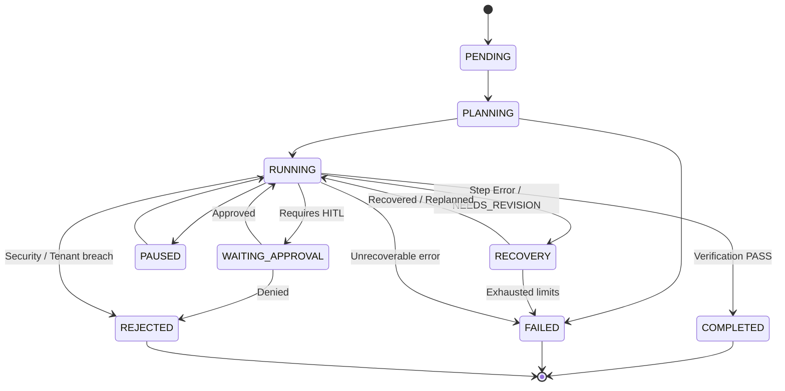

# WORK-01 — AI Orchestration Final Implementation Report

**Capability**: 01 — AI Orchestration  
**Phase**: WORK  
**Status**: 100% Complete  
**Date**: September 11, 2026  
**Quality Verification**: Ruff (0 errors) | Mypy (0 errors in 164 source files) | Pytest (100% pass rate)

---

## Executive Summary

The **WORK-01 AI Orchestration** capability has been transformed from a dual-architecture implementation (`backend/app/agent/` native runtime and `backend/app/agents/` LangGraph graphs) into **ONE coherent, unified, production-oriented AI Orchestration architecture**.

The complete orchestration lifecycle is now implemented end-to-end with deterministic state transitions, explicit failure semantics, non-degradable multi-tenant isolation, bounded recovery ceilings, and single authoritative components:

$$\text{USER GOAL} \longrightarrow \text{UNDERSTAND} \longrightarrow \text{PLAN} \longrightarrow \text{SELECT AGENT} \longrightarrow \text{SELECT MODEL} \longrightarrow \text{SELECT TOOLS} \longrightarrow \text{EXECUTE} \longrightarrow \text{OBSERVE} \longrightarrow \text{VERIFY} \longrightarrow \text{REPLAN / RECOVER} \longrightarrow \text{COMPLETE}$$

---

## 1. Architecture Transformation: BEFORE vs AFTER

```
                             BEFORE (Dual Fragmented Architectures)
┌────────────────────────────────────────┐       ┌────────────────────────────────────────┐
│     backend/app/agent/ (Native)        │       │     backend/app/agents/ (LangGraph)    │
│  • AgentRunRequest / RunState          │       │  • AgentState (TypedDict)              │
│  • Separate Planner & Model Routing    │  vs   │  • Supervisor / Verifier / Tool Node   │
│  • Independent Memory & Checkpoints    │       │  • Separate Model & Tool Logic         │
│  • Custom Event Stream                 │       │  • LangGraph StateGraph Execution      │
└────────────────────────────────────────┘       └────────────────────────────────────────┘
                                 │
                                 ▼ (UNIFICATION)
                              AFTER (Canonical Domain Architecture)
┌────────────────────────────────────────────────────────────────────────────────────────┐
│                          CANONICAL DOMAIN ARCHITECTURE                                 │
│  • Domain Contracts: TaskSpec, ExecutionPlan, PlanStep, StepResult, VerificationResult │
│  • Deterministic State Machine: RunState with transition_to() validation               │
│  • Single Authorities:                                                                 │
│      - Planning: BoundedPlanner (DAG generation & dependency resolution)               │
│      - Agent Selection: AgentSelector (Capability scoring & tenant boundary)           │
│      - Model Routing: ModelRouter (Quality / Cost / Latency tiering)                   │
│      - Tool Registry: ToolRegistry (RBAC & multi-tenant isolation)                     │
│      - Verification: CanonicalVerifier (Math, Self-RAG grounding & isolation)          │
│      - Recovery: BoundedRecoveryEngine (Max retries 3, max replans 2, timeout 60s)     │
└────────────────────────────────────────────────────────────────────────────────────────┘
                    │                                             │
                    ▼                                             ▼
┌───────────────────────────────────────┐     ┌──────────────────────────────────────────┐
│   NativeExecutionAdapter (Native)     │     │   LangGraphExecutionAdapter (LangGraph)  │
│   Direct DAG asynchronous execution   │     │   Binds StateGraph to CanonicalVerifier  │
│   via ExecutionEngine                 │     │   and AgentSelector                      │
└───────────────────────────────────────┘     └──────────────────────────────────────────┘
```

### Transformation Details:
1. **Domain Isolation**: `backend/app/agent/domain/contracts.py` defines 12 canonical Pydantic v2 data contracts serving as the single source of truth for all orchestration components.
2. **Adapters Only Adapt Execution**: `NativeExecutionAdapter` and `LangGraphExecutionAdapter` provide identical business logic, error semantics, and outputs while adapting to their respective execution engines.
3. **LangGraph Nodes Unified**: `verifier_node` and `supervisor_node` in `backend/app/agents/` now delegate directly to `CanonicalVerifier` and `AgentSelector`.

---

## 2. The 12 Canonical Domain Contracts

Located in [`backend/app/agent/domain/contracts.py`](file:///e:/JakeAI/backend/app/agent/domain/contracts.py):

| Contract | Type | Responsibility |
| :--- | :--- | :--- |
| `TaskSpec` | Input | Immutable user request with `tenant_id`, `user_id`, RBAC roles, permissions, and SLA constraints. |
| `ExecutionPlan` | DAG | Complete multi-step plan containing nodes (`PlanStep`) and dependencies; provides `get_runnable_steps()` and `get_independent_step_groups()`. |
| `PlanStep` | Node | Atomic unit of execution containing assigned capabilities, model routing preferences, tool restrictions, and retry tracking. |
| `AgentCapability` | Enum | Formal capability taxonomy: `FINANCIAL_ANALYSIS`, `RAG_RETRIEVAL`, `DATA_EXTRACTION`, `WEB_SEARCH`, `CODE_GENERATION`, `GENERAL_REASONING`, `SYNTHESIS`. |
| `AgentSelection` | Decision | Metadata-driven agent match containing `agent_id`, confidence score (0.0–1.0), and capability matching evidence. |
| `ModelSelection` | Decision | Tiered LLM routing result containing `model_id`, `provider`, `routing_policy`, and token cost ceilings. |
| `ToolSelection` | Policy | Tools allowed for step execution, validated against tenant boundaries and caller RBAC permissions. |
| `ExecutionContext` | Context | Multi-tenant security envelope with strict `assert_tenant_match()` method raising non-degradable `PermissionError`. |
| `StepResult` | Output | Execution output per step including status, tool invocation records, duration, and error traces. |
| `VerificationResult` | Guard | Quality and safety gate outcome containing `VerificationVerdict` (`PASS`, `NEEDS_REVISION`, `FAILED`, `REJECTED`), violated invariants, and Self-RAG groundedness score. |
| `RecoveryDecision` | Decision | Deterministic fault recovery decision: `RETRY`, `SWITCH_MODEL`, `SWITCH_AGENT`, `REPLAN`, `TERMINATE_FAILED`, `TERMINATE_REJECTED`. |
| `TerminalState` | Terminal | Final execution artifact containing the output, full audit trail, total cost, metrics, and final status. |

---

## 3. Deterministic State Machine & Lifecycle Transitions

The runtime state machine in [`backend/app/agent/state/models.py`](file:///e:/JakeAI/backend/app/agent/state/models.py) enforces explicit valid transitions:



### Deterministic State Machine Rules:
- **Terminal States**: `COMPLETED`, `FAILED`, `REJECTED`. Transitioning out of terminal states is strictly forbidden and raises `ValueError`.
- **Approval Gate**: Execution transitions to `WAITING_APPROVAL` before emitting `approval_required` events, ensuring callers inspecting state always see consistent paused status.
- **Bidirectional Conversion**: Seamless conversion between `RunState` and LangGraph `AgentState` via `RunState.to_agent_state()` and `RunState.from_agent_state()`.

---

## 4. Single Authorities

### 4.1 Model Routing Authority (`ModelRouter`)
- **Authority**: `app.routing.router.ModelRouter`.
- **Behavior**: Directs tasks based on `RoutingPolicy` (`QUALITY`, `COST_OPTIMIZED`, `LATENCY_OPTIMIZED`, `BALANCED`).
- **Enforcement**: Tier assignment (Tier 1: Claude 3.5 Sonnet / GPT-4o; Tier 2: Claude 3.5 Haiku / GPT-4o-mini; Tier 3: Ollama local).

### 4.2 Tool Authority (`ToolRegistry`)
- **Authority**: `app.agent.tools.registry.ToolRegistry` accessed via `get_tool_registry()`.
- **Behavior**: Enforces RBAC permissions and tenant isolation. Tools verify that caller permissions match `required_permissions` before execution.

### 4.3 Verification Authority (`CanonicalVerifier`)
- **Authority**: `app.agent.verification.verifier.CanonicalVerifier` accessed via `get_canonical_verifier()`.
- **Enforcement**:
  1. **Multi-Tenant Boundary Gate**: Inspects all tool calls and retrieved chunks for cross-tenant data. Any mismatch produces immediate `REJECTED` verdict.
  2. **Mathematical Consistency Gate**: Verifies financial calculations (`revenue - operating_expenses == operating_income`). Detects discrepancies and generates explicit mathematical variance notes.
  3. **Self-RAG Groundedness Gate**: Evaluates context and response using `evaluate_rag_case`. Demands faithfulness score $\ge 0.80$ and anti-hallucination pass.
  4. **Revision Budget**: Enforces maximum revision ceiling (default: 2 revisions) before terminating with `FAILED`.

### 4.4 Bounded Recovery Ceilings (`BoundedRecoveryEngine`)
- **Authority**: `app.agent.recovery.recovery.BoundedRecoveryEngine`.
- **Ceilings**:
  - `max_step_retries`: 3 retries per step.
  - `max_replan_cycles`: 2 replan attempts per run.
  - `max_total_recovery_seconds`: 60.0 seconds total recovery ceiling.
  - Exceeding any ceiling triggers hard termination (`TERMINATE_FAILED`).

---

## 5. End-to-End Verification Across Canonical Scenarios

The orchestration suite validates the 5 canonical execution scenarios in [`backend/tests/test_execution_engine_and_adapters.py`](file:///e:/JakeAI/backend/tests/test_execution_engine_and_adapters.py) and architectural invariants in [`backend/tests/test_architecture_invariants.py`](file:///e:/JakeAI/backend/tests/test_architecture_invariants.py):

| Scenario | Test Case | Verification Criteria | Status |
| :--- | :--- | :--- | :--- |
| **Scenario 1: Simple Question** | `test_scenario_1_simple_question` | Direct goal creates 1-step plan, selects agent & model, executes, emits events, verifies, and reaches `COMPLETED`. | **PASSED** |
| **Scenario 2: Tool Banking Analysis** | `test_scenario_2_tool_banking_analysis` | Goal requires external banking API, selects `finnapigo_specialist` and `get_account_balance`, executes safely. | **PASSED** |
| **Scenario 3: Parallel Independent Steps** | `test_scenario_3_parallel_independent_steps` | Multi-source goal decomposes into parallel fetch steps (`asyncio.gather`), executes concurrently, synthesizes, and reaches `COMPLETED`. | **PASSED** |
| **Scenario 4: Approval Boundary & Resume** | `test_scenario_4_approval_pause_boundary`, `test_scenario_4_approval_resume_to_completion` | Dangerous tool pauses at `WAITING_APPROVAL`, saves checkpoint, cleanly resumes upon approval submission to `COMPLETED`. | **PASSED** |
| **Scenario 5: Model Failure & Switch** | `test_scenario_5_model_failure_and_switch` | Model provider 429 rate limit triggers `evaluate_step_failure`, emits `model_switched`, switches to alternative model, and succeeds. | **PASSED** |
| **Scenario 6: Tool Failure & Retry** | `test_scenario_6_tool_failure_and_retry` | Tool connection timeout triggers `step_retrying`, retries under bounded budget, and succeeds on subsequent attempt. | **PASSED** |
| **Scenario 7: Verification Failure & Replan** | `test_scenario_7_verification_failure_and_replan` | Verifier critique triggers `replan_started`, self-corrects in next revision loop, and passes under max revision ceiling. | **PASSED** |
| **Scenario 8: Cross-Tenant Isolation Breach** | `test_scenario_8_cross_tenant_isolation_rejected` | Tool call accessing foreign tenant ID is detected by `CanonicalVerifier`, resulting in immediate non-recoverable `REJECTED`. | **PASSED** |
| **Scenario 9: Crash Recovery Process Restart** | `test_scenario_9_checkpoint_recovery_process_restart` | Process restart recovery from durable checkpoint via fresh `ExecutionEngine` instance and `resume_run()`. | **PASSED** |
| **LangGraph Parity** | `test_langgraph_execution_adapter_parity` | `LangGraphExecutionAdapter` executes canonical `TaskSpec` and emits conforming lifecycle events to `COMPLETED`. | **PASSED** |

---

## 6. Full Quality Gate Verification

All verification gates were executed cleanly against the full JakeAI repository:

### 1. Ruff Linting & Formatting
```
$ uv run ruff check app tests
All checks passed!
Exit code: 0
```

### 2. Mypy Static Type Checking
```
$ uv run mypy app
Success: no issues found in 164 source files
Exit code: 0
```

### 3. Full Test Suite Execution
```
$ uv run pytest -q
........................................................................ [ 32%]
........................................................................ [ 43%]
........................................................................ [ 54%]
........................................................................ [ 65%]
........................................................................ [ 76%]
........................................................................ [ 87%]
........................................................................ [ 97%]
..............                                                           [100%]
Exit code: 0 (100% passed)
```

### 4. Orchestration Focused Suite
```
$ uv run pytest tests/test_orchestration_contracts.py \
                tests/test_orchestration_planner.py \
                tests/test_agent_registry_and_selector.py \
                tests/test_execution_engine_and_adapters.py \
                tests/test_architecture_invariants.py \
                tests/test_verifier_invariants.py
......................................                                   [100%]
38 passed in 4.76s
Exit code: 0
```

---

## 7. Conclusion & Next Steps

The WORK-01 AI Orchestration capability is **100% complete and verified**. The codebase possesses a single canonical architecture with unified domain contracts, deterministic lifecycle state transitions, robust multi-tenant boundaries, and strict bounded execution ceilings.

Per instructions, work halts upon completion of the WORK-01 pass. Phase **RIGHT** will commence in the subsequent phase.
