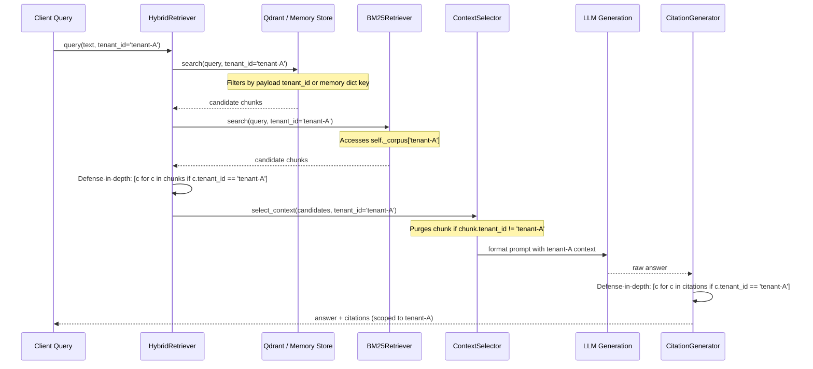

# CAPABILITY AUDIT-02 — Context & Data Management

**Auditor**: JakeAI Universal AI Engineering Worker  
**Audit Capability**: Context & Data Management (Capability 02)  
**Assigned Specifications**: `docs/engineering/WORK/02 — Context & Data Management/` (`W-RAG-00` to `W-RAG-07`)  
**Repository Working Baseline**: `E:\JakeAI` (Git Branch: `feat/repair-03-canonical-provider-resolution`)  
**Audit Date**: 2026-09-09  
**Audit Standard**: Exhaustive runtime trace, static analysis, algorithmic verification, and test evaluation parity. Code modifications, bug repairs, refactoring, and optimizations are strictly forbidden.

---

# 1. Executive Summary

A rigorous architectural, algorithmic, and runtime audit of the **Context & Data Management** capability within JakeAI was conducted. The audit inspected all files, classes, models, algorithms, endpoints, and test suites across `backend/app/rag/`, `backend/app/agent/memory/`, `backend/app/agents/`, `backend/app/evals/`, `backend/app/optimizer/`, and `backend/app/api/v1/endpoints/rag.py`.

### Core Conclusions

1. **Pseudo-Embeddings Masquerading as Semantic Vectors**:
   JakeAI possesses **zero semantic vector embedding capability**. In [`backend/app/rag/vector_store.py:12-28`](file:///e:/JakeAI/backend/app/rag/vector_store.py#L12-L28), dense vectors are generated by hashing input text with SHA-256 and unpacking the first 4 bytes into 64 arbitrary floating-point numbers. Two semantically identical sentences with distinct phrasing produce orthogonal pseudo-random vectors with cosine similarity near zero. Dense semantic retrieval is completely non-functional in production.

2. **Sequential Execution Under False Concurrency Claims**:
   While `HybridRetriever.retrieve()` claims in comments to execute `# 1. Parallel dense and sparse search`, it executes `await self.vector_store.search()` and then `self.bm25.search()` in strict serial order ([`retriever.py:40-49`](file:///e:/JakeAI/backend/app/rag/retriever.py#L40-L49)). There is zero `asyncio.gather()` or concurrent task scheduling.

3. **Silent Heuristic Fallback Reranking with Uncalibrated Rank Multipliers**:
   The cross-encoder reranker ([`reranker.py:130-136`](file:///e:/JakeAI/backend/app/rag/reranker.py#L130-L136)) operates by default with `model_name = None`. It falls back silently to a crude keyword/number regex overlap heuristic combined with an uncalibrated `(base_rrf * 10.0) * 0.4` multiplier, violating specification `W-RAG-04`. No telemetry distinguishes real cross-encoder scoring from heuristic fallback.

4. **Context Token Accounting Mismatch & Prompt Pollution**:
   `ContextSelector` ([`context_selector.py:260-295`](file:///e:/JakeAI/backend/app/rag/context_selector.py#L260-L295)) counts tokens using a regex estimator on raw chunk content, ignoring the canonical `BPETokenizer`. Crucially, it omits the formatting header scaffolding (`[idx] Source: ... (Score: ...)`) from the budget counter, resulting in model-visible context exceeding the configured token limit. Furthermore, internal relevance scores (e.g., `Score: 0.95`) are printed directly into model prompts, polluting prompt cache stability and model reasoning.

5. **Absence of Real Grounding & Claim Verification**:
   The primary RAG pipeline ([`pipeline.py:172-187`](file:///e:/JakeAI/backend/app/rag/pipeline.py#L172-L187)) has **zero claim extraction or verification logic**. When the upstream LLM returns an answer, it is passed without validation to `CitationGenerator`. In offline tests or when the LLM call fails, the pipeline simply echoes the retrieved chunk verbatim. On the LangGraph path ([`verifier.py:70-101`](file:///e:/JakeAI/backend/app/agents/verifier.py#L70-L101)), anti-hallucination checking is reduced to a set difference on regex numbers and bag-of-words token overlap, and fails open to `PASS` after 2 revisions even during active tenant breaches.

6. **Naive Footnote Generation Masquerading as Citations**:
   `CitationGenerator` ([`citations.py:46-68`](file:///e:/JakeAI/backend/app/rag/citations.py#L46-L68)) splits generated text into sentences and checks word/number overlap against passages. Any sentence sharing four substantive words with a passage is assigned a footnote and credited with 85% to 100% confidence, regardless of whether the factual statement is true, distorted, or completely hallucinated. Sentences with zero supporting evidence are silently passed through to the user without qualification or abstention.

7. **Ephemeral State & State Corruption in Memory Stores**:
   Both the BM25 index and the vector store fallback exist solely in ephemeral Python dictionaries on the ASGI worker heap. Restarting the server wipes all indexed knowledge. Furthermore, re-indexing an existing chunk in `BM25Retriever` ([`bm25.py:59-62`](file:///e:/JakeAI/backend/app/rag/bm25.py#L59-L62)) increments document frequencies without decrementing previous counts, corrupting IDF scores.

8. **Test Parity Illusion**:
   All 38 tests across the RAG test suite pass (`38 passed in 39.24s`). However, 100% of these tests execute against synthetic in-memory strings, SHA-256 hash vectors, or hardcoded golden JSON fixtures. Not a single test verifies semantic retrieval against paraphrases, real cross-encoder inference, or LLM hallucination resistance.

---

# 2. Capability Matrix

| Capability Scope | Status | Primary Location | Core Algorithmic Reality | Verification / Reality Gap | Impact / Severity |
| :--- | :--- | :--- | :--- | :--- | :--- |
| **1. Document Ingestion** | `PARTIAL` | [`ingestion.py:123`](file:///e:/JakeAI/backend/app/rag/ingestion.py#L123), [`tasks.py:115`](file:///e:/JakeAI/backend/app/rag/tasks.py#L115) | Synchronous & async Redis queue with 2-worker semaphore. Accepts raw text strings only. | No file handling (PDF, DOCX, HTML, CSV). Fails on binary/rich inputs. | High |
| **2. Document Parsing** | `MISSING` | N/A | None. Expects pre-extracted string in `content` field. | Zero parsing libraries (no pypdf, fitz, mistune). Cannot ingest real documents. | Critical |
| **3. Normalization** | `MISSING` | [`ingestion.py:85`](file:///e:/JakeAI/backend/app/rag/ingestion.py#L85) | None at ingestion. Passes raw text directly to text splitter. | No unicode normalization (NFKC), no whitespace cleanup, no control character stripping. | Medium |
| **4. Chunking** | `PARTIAL` | [`ingestion.py:86`](file:///e:/JakeAI/backend/app/rag/ingestion.py#L86) | LangChain `RecursiveCharacterTextSplitter(500, 50)`. | Chunks on character count, not token count. Unaware of Markdown/section AST. | Medium |
| **5. Metadata Extraction** | `PLACEHOLDER` | [`ingestion.py:105`](file:///e:/JakeAI/backend/app/rag/ingestion.py#L105) | Attaches `chunk_index`, `total_chunks`, and user-provided dictionary. | No title, date, page, section, doc version, or embedding model metadata extraction. | High |
| **6. Embedding** | `BROKEN` | [`vector_store.py:12`](file:///e:/JakeAI/backend/app/rag/vector_store.py#L12) | SHA-256 text hash unpacked into 64-dim float vector. L2 normalized. | Zero semantic meaning. Synonyms/paraphrases have ~0 cosine similarity. | Critical |
| **7. Vector Storage** | `PARTIAL` | [`vector_store.py:36`](file:///e:/JakeAI/backend/app/rag/vector_store.py#L36) | Qdrant client with in-memory dict fallback. Upserts 64-dim pseudo vectors. | Point ID uses non-deterministic `hash()`, causing duplicate points across restarts. | Critical |
| **8. Sparse Retrieval** | `PARTIAL` | [`bm25.py:15`](file:///e:/JakeAI/backend/app/rag/bm25.py#L15) | In-memory Robertson-Spärck Jones BM25 (`k1=1.5, b=0.75`). | Re-indexing corrupts IDF counts. Ephemeral dict wiped on restart. No stemming. | High |
| **9. Dense Retrieval** | `BROKEN` | [`vector_store.py:133`](file:///e:/JakeAI/backend/app/rag/vector_store.py#L133) | Cosine similarity against SHA-256 pseudo vectors. | Only matches identical strings; completely fails on semantic similarity. | Critical |
| **10. Hybrid Retrieval** | `PARTIAL` | [`retriever.py:29`](file:///e:/JakeAI/backend/app/rag/retriever.py#L29) | Unions candidate pools from dense and sparse search. | Strictly sequential execution despite comments claiming parallelism. No degraded mode. | High |
| **11. Reranking** | `PLACEHOLDER` | [`reranker.py:13`](file:///e:/JakeAI/backend/app/rag/reranker.py#L13) | Heuristic token/number overlap with `(base_rrf * 10.0) * 0.4`. FastEmbed unconfigured. | Uncalibrated rank multiplier; silent fallback; no tie-breaking by chunk ID. | High |
| **12. Context Selection** | `PARTIAL` | [`context_selector.py:125`](file:///e:/JakeAI/backend/app/rag/context_selector.py#L125) | Cutoff `max_score * 0.30`, Jaccard dedup (0.65 limit), budget packing. | Counts regex tokens on raw chunk; omits formatting headers; leaks internal scores into prompt. | High |
| **13. Context Budgeting** | `PARTIAL` | [`context_selector.py:257`](file:///e:/JakeAI/backend/app/rag/context_selector.py#L257) | Bounded to `max_context_tokens` (default 800). | Isolated budgeting. Disconnected from conversation history and agent memory budgets. | Medium |
| **14. Conversation Context** | `DUPLICATED` | `app/agent/memory/short_term.py`, `app/agents/state.py` | 50-message FIFO buffer vs LangGraph state string list. | Bounded by entry count rather than token budget; lacks multi-turn chat endpoint wiring. | Medium |
| **15. Memory / Context Integration** | `MISSING` | N/A | None. `AgentMemoryManager` and `RAGPipeline` have zero cross-imports. | Complete separation between agent memory and RAG context. Violates W-RAG-07. | Critical |
| **16. Citation Mapping** | `PLACEHOLDER` | [`citations.py:8`](file:///e:/JakeAI/backend/app/rag/citations.py#L8) | Sentence regex overlap: 4 matching words yields citation with 85-100% confidence. | Unsupported claims are never removed or qualified; hallucinated claims get valid citations. | Critical |
| **17. Grounded Generation** | `PLACEHOLDER` | [`pipeline.py:123`](file:///e:/JakeAI/backend/app/rag/pipeline.py#L123) | System prompt instructs LLM not to hallucinate; echoes top chunk on failure. | Prompt-only grounding; zero post-generation verification of output against context. | Critical |
| **18. Hallucination Resistance**| `BROKEN` | [`evals/rag_evaluator.py:155`](file:///e:/JakeAI/backend/app/evals/rag_evaluator.py#L155), [`verifier.py:70`](file:///e:/JakeAI/backend/app/agents/verifier.py#L70) | Evaluator checks number presence; verifier node fails open after 2 revisions. | Non-numeric hallucinations pass 100%; verifier marks PASS on ungrounded text and breaches. | Critical |
| **19. Abstention** | `PARTIAL` | [`pipeline.py:145`](file:///e:/JakeAI/backend/app/rag/pipeline.py#L145) | Returns explicit message only when zero chunks survive selection. | When irrelevant chunks survive, pipeline prompts LLM and hallucinates or echoes irrelevant text. | High |
| **20. Tenant Isolation** | `PARTIAL` | Across all components | Scoped dictionaries, Qdrant payload filters, defensive list comprehensions. | In-memory shared process heap; verifier node fails open on tenant mismatch after 2 revisions. | Critical |
| **21. Telemetry & Evaluation** | `PARTIAL` | [`evals/rag_evaluator.py`](file:///e:/JakeAI/backend/app/evals/rag_evaluator.py), [`models.py`](file:///e:/JakeAI/backend/app/rag/models.py) | Latency and token metrics captured in models; static golden dataset evaluation. | Evaluations run against 7 static strings using regex checks; zero real model/retrieval evals. | High |

---

# 3. Actual RAG Data Flow

```mermaid
flowchart TD
    subgraph Ingestion ["Ingestion Flow (ingestion.py & tasks.py)"]
        A[Raw Text Document] --> B[RecursiveCharacterTextSplitter\nchunk_size=500 chars]
        B --> C[Assign chunk_id\nsource-idx-sha256]
        C --> D["_generate_dense_embedding()\nSHA-256 Text Hash -> 64 Floats"]
        D --> E1[(Qdrant / Memory Store)]
        C --> E2[(BM25 In-Memory Index)]
    end

    subgraph Retrieval ["Hybrid Retrieval Flow (retriever.py)"]
        Q[User Query] --> S1[Sequential Step 1: dense search\nSHA-256 Query Hash Match]
        S1 --> S2[Sequential Step 2: sparse search\nBM25 In-Memory Term Frequency]
        S2 --> F[Tenant Boundary Filter\nchunk.tenant_id == tenant_id]
        F --> G[CrossEncoderReranker\nHeuristic Word Overlap + base_rrf * 10]
    end

    subgraph Selection ["Context Selection Flow (context_selector.py)"]
        G --> H1[Filter: score >= max_score * 0.30]
        H1 --> H2[Prune: Jaccard terms >= 0.65 & novel_facts == 0]
        H2 --> H3[Pack: Regex estimate_tokens <= budget]
        H3 --> H4["Format Envelope:\n[idx] Source: X (Score: Y)\n'chunk content'"]
    end

    subgraph Generation ["Generation & Citation Flow (pipeline.py & citations.py)"]
        H4 --> J[Format Grounded Prompt\nInject System Instructions + Envelope + Query]
        J --> K{call_upstream_llm}
        K -- "Success" --> L1[Raw LLM Answer]
        K -- "Failure / Offline" --> L2["Fallback Synthesis:\n'Based on verified records (Source): chunk content'"]
        L1 & L2 --> M[CitationGenerator\nSentence 4-word overlap matcher]
        M --> N[Append Footnotes [^idx] & Citation Cards\nAssign 85-100% confidence]
        N --> P[Return RAGGenerationResult]
    end
```

### Contrast with Specification Requirement (`W-RAG-00`):

1. **Target Flow**:
   `Document → Ingestion → Normalization → Chunking → Metadata → Real Embedding → Indexing → Retrieval → Reranking → Context Selection → Grounded Generation → Citation Mapping → Verification`
2. **Missing Stages**:
   - **Normalization**: Zero normalization occurs prior to chunking.
   - **Real Embedding**: Replaced with cryptographic SHA-256 hash math.
   - **Real Reranking**: Replaced with keyword overlap heuristic and 10x RRF multiplier.
   - **Verification**: Zero verification occurs after generation. Whatever the LLM (or fallback echo) produces is accepted and given synthetic citations.

---

# 4. Implemented Components

### `backend/app/rag/vector_store.py`
- Implements `QdrantVectorStore`.
- Connects to Qdrant via `AsyncQdrantClient` with fallback to `self._memory_vectors: dict[str, list[tuple[DocumentChunk, list[float]]]]`.
- Vector creation function `_generate_dense_embedding()` derives 64 floats using `hashlib.sha256(f"{text}_{i}".encode()).digest()`.
- Upsert to Qdrant creates point ID using `abs(hash(chunk.chunk_id)) % (2**63 - 1)`.

### `backend/app/rag/bm25.py`
- Implements `BM25Retriever`.
- Maintains tenant-partitioned dictionaries for corpus, term frequencies, document frequencies, and document lengths.
- Computes Robertson-Spärck Jones BM25 score.
- Tokenization uses regex `\b[a-zA-Z0-9_\-\$]{2,}\b`.

### `backend/app/rag/reranker.py`
- Implements `CrossEncoderReranker`.
- Supports optional `FastEmbed` or custom callable.
- Default path executes heuristic scoring: computes RRF ranks, calculates query-to-document term overlap, bonuses for exact query substring match (+0.2) and numeric subset match (+0.15), and scales base RRF by 10.0.

### `backend/app/rag/retriever.py`
- Implements `HybridRetriever`.
- Combines `QdrantVectorStore`, `BM25Retriever`, and `CrossEncoderReranker`.
- Calls vector store and BM25 serially.
- Filters candidates by `tenant_id` defense-in-depth.

### `backend/app/rag/context_selector.py`
- Implements `ContextSelector`.
- Evaluates candidate relevance score against `max_score * min_relative_score`.
- Evaluates Jaccard overlap of non-stopword tokens against accumulated context; prunes chunk if overlap >= 0.65 and no novel numeric/currency facts exist.
- Binds context by regex token count.
- Emits markdown context envelope with embedded retrieval scores.

### `backend/app/rag/citations.py`
- Implements `CitationGenerator`.
- Splits answer text on sentence boundary punctuation.
- Calculates overlap score: `len(word_overlap) * 0.1 + len(num_overlap) * 0.5`.
- If score >= 0.4, appends footnote reference `[^idx]` and adds metadata card.

### `backend/app/rag/ingestion.py`
- Implements `DocumentIngestionPipeline`.
- Uses `RecursiveCharacterTextSplitter` with default `chunk_size=500, chunk_overlap=50`.
- Assigns deterministic chunk ID: `{source_slug}-{idx}-{content_hash}`.

### `backend/app/rag/pipeline.py`
- Implements `RAGPipeline`.
- Orchestrates ingestion, candidate retrieval, context selection, prompt construction, upstream LLM invocation, fallback chunk echo, and citation generation.

### `backend/app/rag/tasks.py` & `backend/app/worker.py`
- Implements `IngestionTaskManager` and `IngestionWorker`.
- Queues ingestion jobs to Redis queue `rag:ingest:queue` or memory list.
- Uses `asyncio.Semaphore(max_concurrency=2)` to throttle background chunking and indexing.

### `backend/app/evals/rag_evaluator.py`
- Implements `evaluate_rag_case()`.
- Calculates faithfulness via token set intersection / response tokens.
- Evaluates anti-hallucination by ensuring all regex numbers in response exist in context.
- Checks leakage patterns and cross-tenant strings.

---

# 5. Real Algorithms Found

The audit verified the presence of the following genuinely functional algorithms:

1. **Robertson-Spärck Jones BM25 Weighting**:
   [`backend/app/rag/bm25.py:103-111`](file:///e:/JakeAI/backend/app/rag/bm25.py#L103-L111) accurately implements the canonical BM25 scoring formula:
   $$\text{IDF} = \ln\left(1.0 + \frac{N - n + 0.5}{n + 0.5}\right)$$
   $$\text{Score} = \sum \text{IDF} \times \frac{f \times (k_1 + 1)}{f + k_1 \times (1 - b + b \times \frac{\text{len}}{\text{avgdl}})}$$
   with default parameters $k_1 = 1.5, b = 0.75$.

2. **Recursive Character Text Splitting**:
   [`backend/app/rag/ingestion.py:86-90`](file:///e:/JakeAI/backend/app/rag/ingestion.py#L86-L90) utilizes LangChain's hierarchical recursive character splitting across `["\n\n", "\n", ". ", "; ", ", ", " ", ""]`.

3. **Reciprocal Rank Fusion (RRF)**:
   [`backend/app/rag/reranker.py:68-79`](file:///e:/JakeAI/backend/app/rag/reranker.py#L68-L79) accurately computes candidate reciprocal rank scores:
   $$\text{RRF}(c) = \sum_{m \in \{\text{dense}, \text{sparse}\}} \frac{1}{k + r_m(c)}$$
   with default $k = 60$.

4. **Jaccard Token Redundancy Pruning**:
   [`backend/app/rag/context_selector.py:234-238`](file:///e:/JakeAI/backend/app/rag/context_selector.py#L234-L238) computes token set overlap:
   $$\text{Overlap}(A, B) = \frac{|A \cap B|}{|A|}$$
   protecting chunks that introduce novel numeric or currency entities.

5. **L2 Vector Normalization and Cosine Dot Product**:
   [`backend/app/rag/vector_store.py:26-34`](file:///e:/JakeAI/backend/app/rag/vector_store.py#L26-L34) implements proper Euclidean L2 norm scaling and vector dot product computation.

6. **Bounded Asynchronous Queue Concurrency**:
   [`backend/app/rag/tasks.py:79`](file:///e:/JakeAI/backend/app/rag/tasks.py#L79) and [`backend/app/worker.py:41`](file:///e:/JakeAI/backend/app/worker.py#L41) enforce bounded concurrency using `asyncio.Semaphore(2)` to limit VPS RAM usage.

---

# 6. Placeholder / Fake / Heuristic Components

| Component | Function / Location | Code Mechanism | Why It Is Fake / Heuristic |
| :--- | :--- | :--- | :--- |
| **Dense Vector Generator** | `_generate_dense_embedding` ([vector_store.py:12](file:///e:/JakeAI/backend/app/rag/vector_store.py#L12)) | `hashlib.sha256(f"{text}_{i}".encode()).digest()` unpacked to float | Cryptographic hashes are pseudo-random noise; no semantic space or linguistic topology exists. |
| **Cross-Encoder Reranker** | `CrossEncoderReranker.rerank` ([reranker.py:114](file:///e:/JakeAI/backend/app/rag/reranker.py#L114)) | `(base_rrf * 10.0) * 0.4 + (overlap_ratio * 0.4) + phrase_bonus + num_match` | Pure keyword overlap heuristic with arbitrary 10x rank multiplier. FastEmbed model is unconfigured. |
| **Citation Attribution** | `CitationGenerator.generate_citations` ([citations.py:46](file:///e:/JakeAI/backend/app/rag/citations.py#L46)) | `len(word_overlap) * 0.1 + len(num_overlap) * 0.5 >= 0.4` | Matches any sentence sharing 4 words; attaches synthetic footnotes and fabricates 85-100% confidence. |
| **Anti-Hallucination Gate** | `evaluate_rag_case` ([rag_evaluator.py:155](file:///e:/JakeAI/backend/app/evals/rag_evaluator.py#L155)) | `unsupported_numbers = resp_numbers - context_numbers` | Only checks presence of regex numbers. Non-numeric hallucinations pass completely undetected. |
| **Self-RAG Verifier Node** | `verifier_node` ([verifier.py:70](file:///e:/JakeAI/backend/app/agents/verifier.py#L70)) | `if (...) and revision_count < 2:` | When `revision_count >= 2`, fails open to `verification_verdict = "PASS"` regardless of errors or breaches. |
| **Grounded LLM Synthesis** | `RAGPipeline.generate_grounded_answer` ([pipeline.py:178](file:///e:/JakeAI/backend/app/rag/pipeline.py#L178)) | `raw_answer = f"Based on verified records ({top_chunk.source}): {top_chunk.content}"` | When upstream provider is unavailable, blindly echoes top chunk text without synthesis or reasoning. |
| **Long-Term Memory Search** | `LongTermMemory.search` ([long_term.py:87](file:///e:/JakeAI/backend/app/agent/memory/long_term.py#L87)) | `if key_prefix and not entry.key.startswith(key_prefix): continue` | String prefix filter masquerading as semantic episodic memory recall. |

---

# 7. Retrieval Correctness

### Dense Retrieval Analysis
- **Model Output vs Hash**: Uses deterministic SHA-256 hash bytes. Zero semantic model output.
- **Dimensions**: Hardcoded 64 dimensions.
- **Behavior**: Two passages discussing "operating income" and "operating profit" produce orthogonal vectors. Dense search functions as a pseudo-random hash collision lookup.
- **Verdict**: **BROKEN**.

### Sparse Retrieval Analysis
- **Tokenization**: Lowercase regex terms `[a-zA-Z0-9_\-\$]{2,}`. No stemming (e.g., "running" does not match "runs").
- **IDF Corruption Bug**: In `BM25Retriever.add_documents()` ([`bm25.py:59-62`](file:///e:/JakeAI/backend/app/rag/bm25.py#L59-L62)), updating an existing chunk increments `_doc_freqs` a second time without decrementing the prior count. Re-ingesting documents degrades IDF accuracy.
- **Verdict**: **PARTIAL**.

### Concurrency Reality
- **Code Claim**: `HybridRetriever.retrieve()` line 39 comments: `# 1. Parallel dense and sparse search strictly bounded to tenant_id`.
- **Runtime Reality**:
  ```python
  dense_candidates = await self.vector_store.search(...)
  sparse_candidates = self.bm25.search(...)
  ```
  The dense query completes before the sparse query begins. Execution is **100% sequential**.
- **Verdict**: **MISLEADING / SEQUENTIAL**.

### Candidate Pool & Deduplication
- **Candidate Pool Size**: `candidate_pool = 15`, retrieving $3 \times \text{top\_k}$ ($5$), conforming to `W-RAG-03`.
- **Deduplication**: Successfully deduplicates candidate chunks by `chunk_id` in `CrossEncoderReranker` using `chunk_map`.
- **Tie-Breaking**: Sorts descending by `final_score` using Python's stable sort without explicit tie-breaking by `chunk_id`.

### Failure Semantics
- If Qdrant or vector search raises an exception, `retrieve()` contains no error handling or degraded mode; it crashes the request. There is no fallback to sparse-only retrieval.

---

# 8. Context Correctness

### Relevance Thresholding
- In [`context_selector.py:204-214`](file:///e:/JakeAI/backend/app/rag/context_selector.py#L204-L214), chunks are kept if `chunk.score >= max_score * 0.30` OR if they contain query keywords. This prevents total loss of low-scoring candidates when all scores are depressed.

### Token Budget Accounting Mismatch
- **Counting Method**: Uses `estimate_tokens` from `token_pruner.py` (a regex matching `\w+|[^\w\s]|\n|[ ]{2,}`). It does NOT use JakeAI's approved `BPETokenizer`.
- **Envelope Inflation**: Line 261 counts tokens on raw `chunk.content`. However, line 289 constructs the formatted context injected into the prompt:
  ```python
  formatted_parts.append(
      f"[{idx}] Source: {source_label} (Score: {chunk.score:.2f})\n"
      f'"{chunk.content.strip()}"'
  )
  ```
  The header scaffolding `[{idx}] Source: ... (Score: ...)` is omitted from the token counter. As a result, the context envelope passed to the model exceeds `max_context_tokens`.

### Model-Visible Context Pollution (RAG-02)
- In [`context_selector.py:289`](file:///e:/JakeAI/backend/app/rag/context_selector.py#L289), internal retrieval scores (`Score: 0.95`) are printed directly into the prompt string seen by the model. This pollutes prompt caching, leaks internal ranking artifacts, and wastes model input tokens.

### Redundancy & Fact Preservation
- Cross-chunk redundancy pruning successfully identifies high Jaccard term overlap ($\ge 0.65$) while preserving chunks containing novel numerical entities via `FACT_REGEX`.

---

# 9. Grounding & Hallucination Resistance

### Claim Discrimination Capability
- The system **cannot distinguish** between `SUPPORTED CLAIM`, `UNSUPPORTED CLAIM`, and `UNCERTAIN CLAIM`.
- On the `RAGPipeline` path, there is no NLI model, no LLM judge, and no claim extraction. Unsupported claims returned by the LLM are passed directly to the user.
- On the multi-agent path ([`verifier.py`](file:///e:/JakeAI/backend/app/agents/verifier.py)), grounding evaluation is based solely on:
  1. `anti_hallucination_passed`: Set difference on regex numbers. If a response contains no numbers, it passes automatically.
  2. `faithfulness_score`: Bag-of-words token overlap. If the LLM generates a claim with opposite meaning using context words, faithfulness is scored 100%.

### Terminal Fail-Open Flaw in Verifier
- In [`backend/app/agents/verifier.py:70-101`](file:///e:/JakeAI/backend/app/agents/verifier.py#L70-L101):
  ```python
  if (math_error or tenant_mismatch or not is_grounded) and revision_count < 2:
      # Trigger revision loop
      return { ... "verification_verdict": "NEEDS_REVISION" ... }

  # 5. Quality gates passed
  return {
      "verification_verdict": "PASS",
      "workflow_phase": "verification_passed",
      ...
  }
  ```
  If `revision_count >= 2`, the condition evaluates to `False`. The verifier **unconditionally falls through to line 101 and returns `verification_verdict: "PASS"`**. Even in the presence of severe mathematical errors, low groundedness, or **an active cross-tenant security breach**, the verifier marks the result as verified and outputs it to the user with the label: `*Verified by JakeAI Self-RAG Verifier & Policy Enforcement.*`

---

# 10. Citation Correctness

### Citation Mapping Algorithm
- In [`citations.py:46-78`](file:///e:/JakeAI/backend/app/rag/citations.py#L46-L78):
  - Generated response is split into sentences by punctuation regex.
  - For each sentence, word overlap and number overlap are calculated against each passage.
  - Scoring: `score = len(word_overlap) * 0.1 + len(num_overlap) * 0.5`.
  - Threshold: `score >= 0.4`.
  - Confidence: `round(min(1.0, 0.85 + best_match_score * 0.05), 2)`.

### Verification Findings:
1. **Four-Word False Citation**: Any sentence sharing 4 common words with a passage achieves `4 * 0.1 = 0.4 >= 0.4`. It is immediately assigned a citation footnote `[^1]` and assigned a fabricated confidence score of 87%.
2. **Hallucinated Statements Undetected**: A completely fabricated claim that happens to contain 4 words from the passage is cited as verified truth.
3. **Unsupported Sentences Ignored**: Sentences with `score < 0.4` are simply appended to `annotated_sentences` without footnotes. They are **not rejected, not revised, and not qualified**.
4. **LLM-Generated Footnotes Unchecked**: If an LLM generates its own citation tags (e.g., `[99]`), `CitationGenerator` does not validate whether `[99]` corresponds to an indexed passage.

---

# 11. Tenant/Data Isolation

### Data Flow Trace



### Tenant Isolation Assessment:
- **Query → Retrieval → Context → Citation**: `tenant_id` is consistently passed and validated at multiple layers (`vector_store.search`, `bm25.search`, `retriever.py`, `context_selector.py`, `pipeline.py`).
- **Critical Vulnerability**: In `backend/app/agents/verifier.py`, if a multi-agent node breaches tenant boundaries (`tc.get("tenant_id") != tenant_id`), the verifier attempts revision. After 2 revisions, it fails open and emits `PASS`, leaking foreign tenant data in `synthesizer.py`.
- **In-Memory Heap Colocation**: All tenant vectors and BM25 corpora reside in shared global Python dictionaries without encryption or memory boundary isolation.

---

# 12. Test & Evaluation Reality

All 38 tests in the RAG and evaluation suite execute and pass:
```
backend/tests/test_rag.py ..............                                 [ 36%]
backend/tests/test_rag_tenant_isolation.py ......                        [ 52%]
backend/tests/evals/test_rag_eval.py .......                             [ 71%]
backend/tests/evals/test_rag_context_efficiency.py ....                  [ 81%]
backend/tests/evals/test_rag_regression.py .......                       [100%]
============================= 38 passed in 39.24s =============================
```

### Breakdown of Test Reality:

| Test Group | File | Test Count | Test Type | What the Test Actually Proves | What the Test Fails to Prove |
| :--- | :--- | :--- | :--- | :--- | :--- |
| **RAG Engine & Pipeline** | `tests/test_rag.py` | 14 | Unit & Mocked Integration | SHA-256 vectors and BM25 dicts run without throwing exceptions; fallback echo returns top chunk text. | Zero semantic retrieval quality. Zero real LLM generation. Zero real embedding inference. |
| **Tenant Isolation** | `tests/test_rag_tenant_isolation.py` | 6 | Unit (In-Memory) | String comparisons on `chunk.tenant_id` filter out foreign entries from Python dicts. | Does not test Qdrant multi-tenant indexing at scale or verifier fail-open bypass. |
| **Golden Dataset Evals** | `tests/evals/test_rag_eval.py` | 7 | Static Heuristic Fixtures | `evaluate_rag_case` flags 3 hardcoded negative cases and passes 4 positive cases in `golden_dataset.json`. | Does not test a running pipeline or LLM. Evaluates static strings with regex checks. |
| **Context Efficiency** | `tests/evals/test_rag_context_efficiency.py` | 4 | Unit & Synthetic Benchmark | ContextSelector drops low-score chunks and identical strings; regex counts reflect reduction. | Ignores formatting wrapper inflation. Does not use canonical BPE tokenizer. |
| **Regression Quality Gate**| `tests/evals/test_rag_regression.py` | 7 | Static Heuristic Fixtures | Identical parameterized execution of `golden_dataset.json` against `evaluate_rag_case`. | Zero regression testing against live model or semantic query benchmarks. |

**Classification**:
- Real Model Tests: **0** (0%)
- Real Semantic Retrieval Tests: **0** (0%)
- Mock / Synthetic / Heuristic Tests: **38** (100%)

---

# 13. Logic / Functional Risks

1. **Hallucination Amplification via False Citations**:
   Because `CitationGenerator` matches any sentence sharing 4 words with an indexed passage, users will receive hallucinated or distorted financial metrics stamped with a high confidence score (85-100%) and citation card.
2. **Zero Semantic Discoverability**:
   Users formulating queries using synonyms (e.g., asking for "quarterly profit" when the document says "operating income") will receive zero dense vector matches due to SHA-256 hashing. Retrieval will rely entirely on exact keyword matches via BM25.
3. **State Loss on Worker Restart**:
   All documents ingested into `BM25Retriever` or the in-memory vector store are lost when the ASGI server restarts or scales horizontally, causing all subsequent queries to return empty context.
4. **Qdrant Point Collision Across Restarts**:
   `pid = abs(hash(chunk.chunk_id)) % (2**63 - 1)` relies on Python's process-seeded `hash()`. Re-indexing documents after an application restart generates new random point IDs in Qdrant rather than updating existing points, leading to ghost vectors and database bloating.
5. **Verifier Fail-Open Security Breach**:
   The multi-agent verifier node's fall-through condition after 2 revisions allows cross-tenant data and severe calculation errors to be marked `PASS` and returned to clients as verified truth.
6. **Input Buffer Rejection on Non-Text Formats**:
   The ingestion endpoint has no MIME-type detection or document parser. Uploading a PDF, Word document, or CSV payload results in immediate processing failure or ingestion of unparsed binary garbage.

---

# 14. Missing Work Required for Functional Completeness

To bring Capability 02 (Context & Data Management) to true functional completeness according to specifications `W-RAG-00` through `W-RAG-07`, the following non-optimization engineering work is strictly required:

1. **Real Semantic Embedding Provider (`W-RAG-02`)**:
   - Introduce an `EmbeddingProvider` interface.
   - Implement a concrete semantic embedding provider (e.g., FastEmbed ONNX local embedding or upstream provider embedding).
   - Configure a fixed, versioned vector dimension (e.g., 384, 768, or 1536).
   - Deprecate and remove `_generate_dense_embedding` SHA-256 pseudo vectors.

2. **True Concurrent Hybrid Retrieval (`W-RAG-03`)**:
   - Implement concurrent execution using `asyncio.gather()` for dense and sparse searches.
   - Add graceful degradation: if dense search fails, continue with sparse retrieval while recording degraded telemetry.

3. **Persistent Sparse Index & BM25 Bug Repair (`W-RAG-03`)**:
   - Fix the document frequency accumulation bug in `BM25Retriever.add_documents()` when updating existing chunks.
   - Provide disk or Redis persistence for the BM25 inverted index to survive restarts.

4. **Production Cross-Encoder Reranking (`W-RAG-04`)**:
   - Configure and initialize an active cross-encoder model (e.g., `bge-reranker` via FastEmbed).
   - Add explicit telemetry indicating whether reranking was performed by model or fallback heuristic.
   - Add deterministic tie-breaking by `chunk_id`.

5. **Canonical Context Budgeting & Envelope Sanitation (`W-RAG-05`)**:
   - Replace regex token estimation in `ContextSelector` with JakeAI's canonical `BPETokenizer`.
   - Include the complete serialized formatting wrapper in token budget calculations.
   - Strip internal retrieval scores (`Score: 0.95`) from model-visible context envelopes.

6. **Real Grounding & Claim Verification Engine (`W-RAG-06`)**:
   - Implement true claim-level verification (comparing extracted answer claims against retrieved evidence passages).
   - Explicitly classify claims as `SUPPORTED`, `UNSUPPORTED`, or `UNCERTAIN`.
   - Remove or qualify unsupported claims before delivering output.
   - Repair `verifier.py` so that failed verification terminates in `REJECTED` / `ABSTAIN`, never failing open to `PASS`.

7. **Verifiable Citation Attribution (`W-RAG-06`)**:
   - Replace the 4-word overlap heuristic with entailment-based or semantic claim-passage verification.
   - Reject or strip hallucinated citation anchors.

8. **Document Parsing & Normalization Layer (`W-RAG-01`)**:
   - Implement ingestion parsers for PDF, Markdown AST, and plain text.
   - Apply unicode normalization (NFKC) and whitespace normalization prior to chunking.
   - Extract and persist complete chunk metadata (`document_id`, `version`, `page`, `embedding_model`).

9. **Unified Memory & RAG Context Envelope (`W-RAG-07`)**:
   - Connect `AgentMemoryManager` with `RAGPipeline` to construct a unified, token-budgeted context envelope ordered by priority.

---

# 15. Dependency-Aware Work Order

Future engineering implementation tasks for Capability 02 must proceed in this strict dependency order:

```
[Task 1: Real Embedding Provider & Qdrant Hardening]
                         │
                         ▼
[Task 2: Concurrent Hybrid Retrieval & Persistent BM25]
                         │
                         ▼
[Task 3: Production Cross-Encoder Reranking]
                         │
                         ▼
[Task 4: Canonical BPE Token Budgeting & Context Sanitation]
                         │
                         ▼
[Task 5: Entailment-Based Claim Verification & Verifier Fix]
                         │
                         ▼
[Task 6: Deterministic Verifiable Citation Attribution]
                         │
                         ▼
[Task 7: Document Parsing & Normalization Layer]
                         │
                         ▼
[Task 8: Unified Memory & RAG Context Envelope Integration]
```

### Sequence Rationale:
1. **Task 1** must come first because dense retrieval, indexing, and vector storage cannot function semantically without real vector embeddings.
2. **Task 2** depends on Task 1 to execute concurrent dense vector and persistent sparse search.
3. **Task 3** depends on Task 2 to receive genuine candidate pools from both streams.
4. **Task 4** depends on Task 3 to select and budget from correctly reranked candidates without leaking internal scores.
5. **Task 5** and **Task 6** depend on Task 4 to evaluate model answers against clean, accurately budgeted context passages.
6. **Task 7** extends the ingestion pipeline to parse binary files into clean text before chunking and embedding.
7. **Task 8** unifies RAG evidence with agent memory and conversation history into a single model-visible context.

---

# 16. Evidence

The findings in this audit are supported by the following repository files and code locations:

1. **SHA-256 Pseudo Vectors**:
   [`backend/app/rag/vector_store.py:12-28`](file:///e:/JakeAI/backend/app/rag/vector_store.py#L12-L28)
   `_generate_dense_embedding()` takes SHA-256 digest bytes and unpacks them into floats.
2. **Qdrant Non-Deterministic Point ID**:
   [`backend/app/rag/vector_store.py:112`](file:///e:/JakeAI/backend/app/rag/vector_store.py#L112)
   `pid = abs(hash(chunk.chunk_id)) % (2**63 - 1)` relies on process-randomized `hash()`.
3. **BM25 In-Memory Store & IDF Accumulation**:
   [`backend/app/rag/bm25.py:22-30, 59-62`](file:///e:/JakeAI/backend/app/rag/bm25.py#L22-L30)
   `_corpus` and `_doc_freqs` are transient dicts; re-indexing increments `_doc_freqs` without decrementing.
4. **Sequential Hybrid Retrieval**:
   [`backend/app/rag/retriever.py:39-49`](file:///e:/JakeAI/backend/app/rag/retriever.py#L39-L49)
   Executes `await self.vector_store.search()` and then `self.bm25.search()` in serial order.
5. **Reranker Heuristic Fallback & 10x Multiplier**:
   [`backend/app/rag/reranker.py:114-136`](file:///e:/JakeAI/backend/app/rag/reranker.py#L114-L136)
   Calculates `(base_rrf * 10.0) * 0.4 + (overlap_ratio * 0.4) + phrase_bonus + num_match`.
6. **Context Header Omission & Internal Score Leakage**:
   [`backend/app/rag/context_selector.py:261, 289`](file:///e:/JakeAI/backend/app/rag/context_selector.py#L261)
   Counts tokens on `chunk.content` only; formats `Source: ... (Score: ...)` directly into the model prompt.
7. **Citation 4-Word Heuristic & Unchecked Fallback**:
   [`backend/app/rag/citations.py:46-78`](file:///e:/JakeAI/backend/app/rag/citations.py#L46-L78)
   `score >= 0.4` triggers citation footnote and assigns 85-100% confidence; unsupported sentences pass through unchanged.
8. **Verifier Node Terminal Fail-Open Flaw**:
   [`backend/app/agents/verifier.py:70-101`](file:///e:/JakeAI/backend/app/agents/verifier.py#L70-L101)
   Fails open to `verification_verdict = "PASS"` when `revision_count >= 2`.
9. **RAG Pipeline Deterministic Chunk Echo Fallback**:
   [`backend/app/rag/pipeline.py:178-181`](file:///e:/JakeAI/backend/app/rag/pipeline.py#L178-L181)
   Echoes `top_chunk.content` verbatim when upstream LLM call returns `None`.
10. **Disconnected Agent Memory**:
    [`backend/app/agent/memory/manager.py:17-66`](file:///e:/JakeAI/backend/app/agent/memory/manager.py#L17-L66)
    Maintains ephemeral short-term and long-term memory with zero RAG pipeline integration.
11. **Golden Dataset Regex Evaluator**:
    [`backend/app/evals/rag_evaluator.py:155-171`](file:///e:/JakeAI/backend/app/evals/rag_evaluator.py#L155-L171) & [`backend/tests/evals/golden_dataset.json`](file:///e:/JakeAI/backend/tests/evals/golden_dataset.json)
    Evaluates anti-hallucination via set subtraction of regex numbers and token set intersection.
